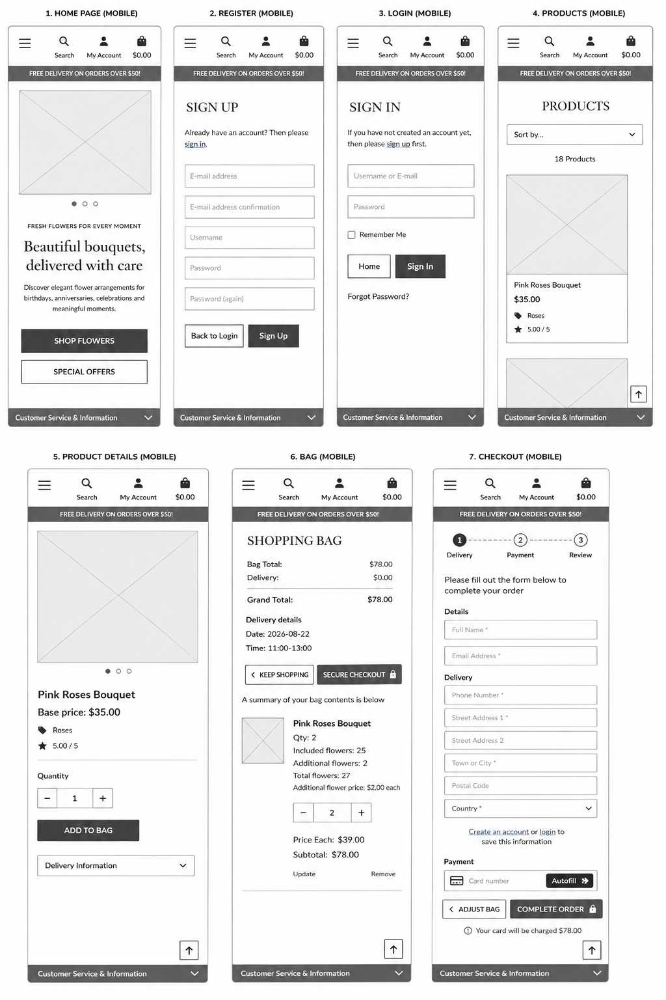
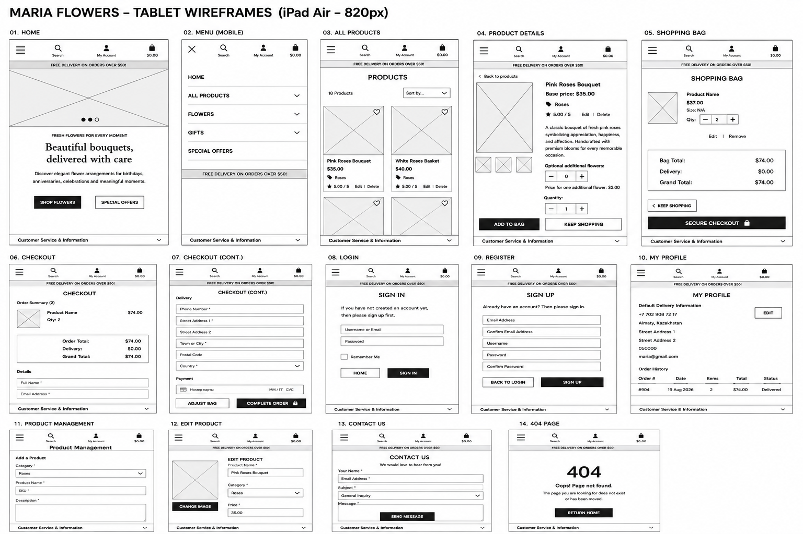
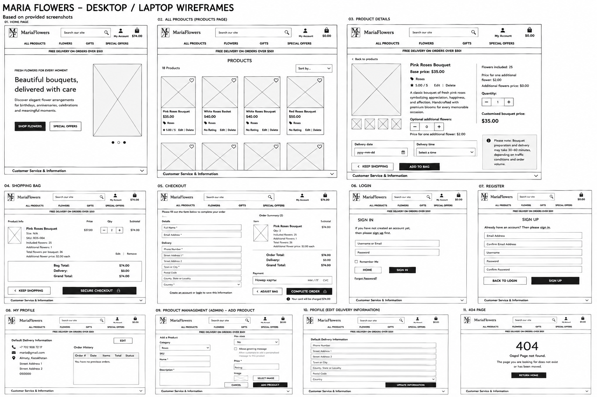
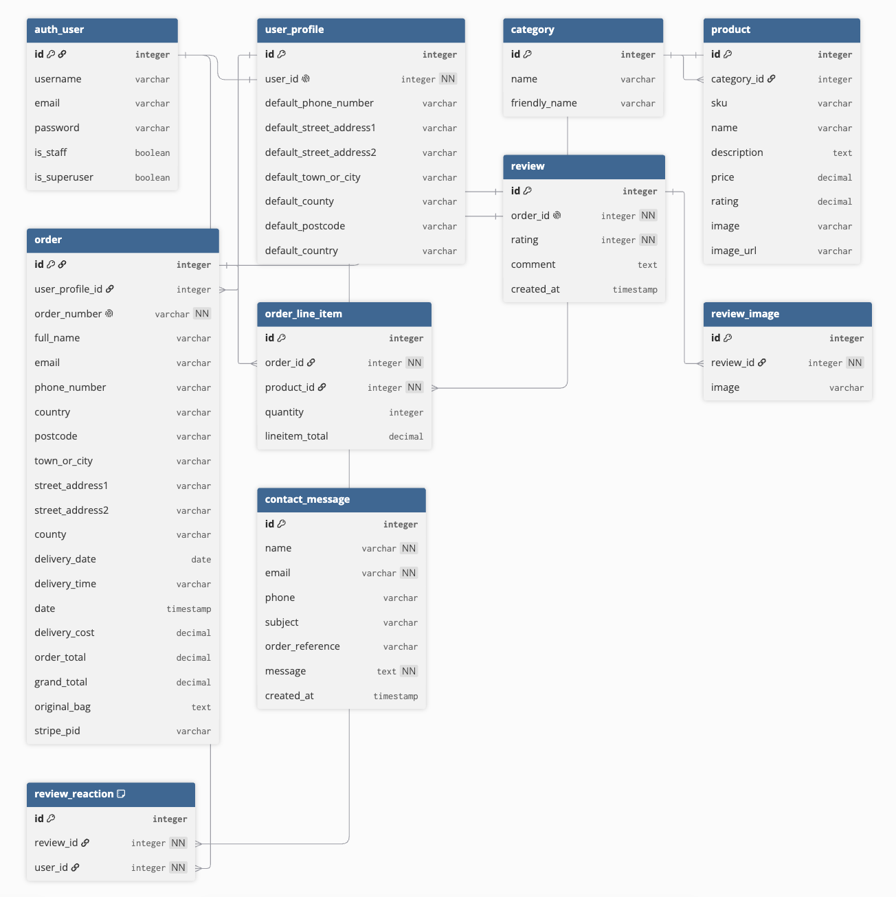

# [mariaflowers](https://mariaflowers.art)

Developer: Azamat Kashebayev ([akashebaev-ux](https://www.github.com/akashebaev-ux))

[](https://www.github.com/akashebaev-ux/mariaflowers/commits/main)
[](https://www.github.com/akashebaev-ux/mariaflowers/commits/main)
[](https://www.github.com/akashebaev-ux/mariaflowers)
[](https://mariaflowers-f9e87b4ebe6c.herokuapp.com)

## Project Introduction and Rationale

Maria Flowers is a full-stack e-commerce flower shop designed to provide customers with a simple, convenient, and reliable way to order fresh flowers online. The application allows users to browse and search a catalogue of flower arrangements, view detailed product information, add products to a shopping bag, select their preferred delivery date and time, and complete their purchase securely using Stripe.

The website is primarily aimed at customers who want to order flowers for occasions such as birthdays, anniversaries, celebrations, romantic occasions, or simply as a gift. The application has been designed to make the ordering process straightforward while giving customers important information about products, delivery, payments, and store policies before completing their purchase.

Registered customers have access to additional functionality, including saved delivery information and order history. Maria Flowers also includes a verified review system that allows eligible customers to rate their purchase, leave an optional comment, and upload review images after the relevant order has been completed. Connecting reviews to genuine customer orders helps make the feedback displayed on the website more trustworthy.

From the business perspective, Maria Flowers provides administrators with tools to manage products, categories, customer orders, reviews, and customer enquiries. The application also integrates email notifications and the WhatsApp Business Cloud API to support communication relating to orders and customer enquiries.

### Project Rationale

I chose to develop Maria Flowers because ordering flowers online involves requirements that go beyond those of a basic e-commerce store. Flowers are frequently purchased for a particular occasion and therefore customers often need control over when their order will be delivered. For this reason, I wanted to develop an e-commerce application where delivery information, customer communication, and post-purchase feedback are important parts of the overall user experience.

The project was originally developed from Code Institute's **Boutique Ado** walkthrough project, which provided the foundation for standard e-commerce functionality such as product management, a shopping bag, checkout, Stripe payments, and customer profiles. I then adapted and extended this foundation to create Maria Flowers as a distinct flower-delivery application.

My custom development includes flower-specific branding and product presentation, delivery date and time selection, extended order functionality, customer contact enquiries, WhatsApp Business integration, and a verified review system with ratings, comments, review images, and reactions.

Developing Maria Flowers allowed me to apply the core full-stack concepts covered throughout the Code Institute course while also extending the original walkthrough project with my own database models, business logic, integrations, validation, testing, responsive design, and user experience decisions.


Source: [ChatGPT](https://chatgpt.com/) and [Google Chrome DevTools](https://developer.chrome.com/docs/devtools/)

> [!IMPORTANT]  
> The examples in these templates are strongly influenced by the Code Institute walkthrough project called "Boutique Ado".

## UX

### The 5 Planes of UX

#### 1. Strategy

**Purpose**

Maria Flowers is a B2C e-commerce flower shop designed to make ordering
fresh flowers online simple, convenient, and reliable.

The main purpose of the application is to allow customers to browse flower
arrangements, select products, choose appropriate delivery details, pay
securely online, and manage their orders through a responsive website.

The application also aims to build customer trust through verified reviews
and clear communication about delivery, refunds, privacy, and other store
policies.

**Primary User Needs**

Visitors need to be able to:

- Browse available flower arrangements without creating an account.
- Search for products using relevant keywords.
- Filter and sort products to find suitable flowers more quickly.
- View detailed product information, images, prices, and ratings.
- Understand delivery, refund, privacy, and purchasing policies.
- Contact Maria Flowers with questions or order enquiries.

Customers need to be able to:

- Register and log in securely.
- Add products to their shopping bag.
- Update or remove products before checkout.
- Select a delivery date.
- Select an available delivery time.
- Enter delivery and contact information.
- Complete payment securely through Stripe.
- Receive confirmation of their order.
- View previous orders from their profile.
- Leave a review when they meet the review eligibility requirements.
- Rate products and provide optional written feedback.
- Upload images with their reviews.
- Interact with existing customer reviews.

The site owner needs to be able to:

- Add new flower products.
- Edit existing products.
- Remove products that are no longer available.
- Organise products into appropriate categories.
- Manage customer orders.
- View customer enquiries.
- Manage customer reviews and uploaded content.
- Maintain the application through Django Admin.

**Business Goals**

The main business goals of Maria Flowers are to:

- Provide an easy way for customers to order flowers online.
- Convert website visitors into paying customers.
- Present flower arrangements professionally through high-quality imagery.
- Make delivery date and time part of the purchasing experience.
- Build trust through reviews connected to genuine customer orders.
- Improve communication through email and WhatsApp.
- Encourage repeat purchases through customer accounts and order history.
- Create a scalable platform that can support additional delivery and
  customer-service functionality in the future.

#### 2. Scope

The scope of Maria Flowers was determined by the requirements of an
e-commerce flower-delivery business and the needs identified during the
strategy stage.

**Core E-commerce Functionality**

The application provides:

- Product catalogue.
- Product detail pages.
- Product categories.
- Product search.
- Product filtering.
- Product sorting.
- Shopping bag.
- Quantity management.
- Secure Stripe checkout.
- Order creation.
- Order confirmation.
- Confirmation emails.
- Customer profiles.
- Order history.

**Maria Flowers Custom Functionality**

To adapt the original e-commerce foundation specifically for a flower
business, additional functionality was implemented, including:

- Delivery date selection.
- Delivery time-slot selection.
- Flower-specific product categories and presentation.
- Verified customer reviews.
- 1–5 star ratings.
- Optional review comments.
- Review image uploads.
- Review reactions.
- Product rating aggregation.
- Customer contact enquiries stored in the database.
- WhatsApp Business Cloud API integration.
- Customer-facing delivery and refund policies.
- Privacy Policy.
- Terms & Conditions.
- FAQ page.
- Custom 404 page.

**Content Requirements**

Product pages provide customers with information such as:

- Product name.
- Product image.
- Description.
- Price.
- Category.
- Customer rating information where available.

The checkout process collects information required to complete a flower
delivery, including:

- Customer name.
- Email address.
- Phone number.
- Delivery address.
- Delivery date.
- Delivery time.
- Order contents.
- Payment information through Stripe.

#### 3. Structure

The structure of Maria Flowers was designed around a straightforward
e-commerce journey.

The main customer journey is:

1. The visitor arrives on the Maria Flowers home page.
2. The visitor browses the flower catalogue or searches for a product.
3. Products can be filtered or sorted to make discovery easier.
4. The visitor opens an individual product page.
5. The customer selects a product and adds it to the shopping bag.
6. The customer reviews the contents of the bag.
7. The customer proceeds to checkout.
8. Delivery and contact information is provided.
9. The customer selects a delivery date and time.
10. Payment is securely processed through Stripe.
11. The customer receives an order confirmation.
12. Registered customers can access the order through their profile.
13. When the order meets the review requirements, the customer can submit
    feedback.

The application's main areas are organised into separate Django apps,
including:

- `home` – homepage, contact and general customer-facing content.
- `products` – product catalogue, product details, searching and sorting.
- `bag` – shopping bag functionality.
- `checkout` – orders, payments, delivery information and review
  functionality.
- `profiles` – saved customer information and order history.

This separation helps keep the codebase organised while maintaining clear
relationships between the different parts of the customer journey.


#### 4. Skeleton

The skeleton plane focuses on how content, navigation, forms, buttons, and
other interface elements are arranged on individual pages.

Maria Flowers uses a responsive layout so that the interface adapts to
different screen sizes.

On larger screens:

- The full navigation menu is displayed.
- Products are displayed across multiple columns.
- The homepage hero section makes use of the wider viewport.
- Account, search, and shopping-bag controls remain easily accessible.

On smaller screens:

- Navigation changes to a compact mobile layout.
- Product grids use fewer columns.
- Hero content is reorganised vertically.
- Images scale according to the available width.
- Buttons and form controls remain large enough for touch interaction.
- Page spacing is reduced to make better use of limited screen space.

The checkout forms are structured to keep related customer and delivery
information together and to guide the customer toward payment.

Wireframes were created for the major pages before or during development to
help define the placement of interface elements across mobile, tablet, and
desktop layouts.

**[Wireframes](#wireframes)** (see below)

#### 5. Surface

**Visual Design Elements**
- **[Colours](#colour-scheme)** (see below)
- **[Typography](#typography)** (see below)

### Colour Scheme

The Maria Flowers colour scheme was selected to create an elegant, modern
and romantic visual identity suitable for a premium flower boutique.

Purple is the primary brand colour and is used throughout the application
for branding, buttons, headings, links and interactive elements. Lighter
purple and neutral tones are used to create contrast while allowing the
flower photography to remain the main visual focus.

[ImageColorPicker.com](https://imagecolorpicker.com/) was used to identify
and select colours for the website.

| Colour | Hex | Usage |
| --- | --- | --- |
| Primary Purple | `#6d0b83` | Branding, buttons, links and key UI elements |
| Dark Purple | `#520863` | Headings, hover states and emphasis |
| Light Purple | `#f3e8f6` | Highlighted areas and subtle backgrounds |
| Background | `#fffafd` | Main page background |
| White | `#ffffff` | Cards, forms and navigation |
| Main Text | `#2f2531` | Primary body text |
| Muted Text | `#6c6570` | Secondary information |
| Border | `#eadced` | Cards, forms and interface borders |
| Black | `#111111` | High-contrast interface elements |

The colours are stored as CSS custom properties, helping maintain a
consistent colour scheme throughout the application.

**Source:** [ImageColorPicker.com](https://imagecolorpicker.com/)


### Typography

The typography for Maria Flowers was selected using
[Google Fonts](https://fonts.google.com/).

The website uses two primary typefaces: **Cormorant Garamond** and **Lato**.

#### Cormorant Garamond

Cormorant Garamond is an elegant serif typeface used for prominent visual
elements throughout Maria Flowers.

It is used for:

- Maria Flowers branding
- Page headings
- Hero headings
- Product titles
- Footer branding

The following font weights are loaded:

- `500` – Medium
- `600` – Semi-bold
- `700` – Bold

Its serif design complements the floral and boutique character of the
website and helps distinguish headings from functional interface text.

#### Lato

Lato is used as the primary body and interface typeface.

It is used for:

- Body text
- Navigation
- Buttons
- Forms
- Product information
- Search controls
- Delivery information
- Customer account elements

The following font weights are loaded:

- `300` – Light
- `400` – Regular
- `700` – Bold
- `900` – Black

Lato was selected because its clean sans-serif appearance remains readable
at smaller sizes and provides a clear contrast with the more decorative
Cormorant Garamond headings.

Fallback fonts are also defined in the CSS so that text remains readable if
Google Fonts cannot be loaded.

**Source:** [Google Fonts](https://fonts.google.com/)

## Wireframes

To follow responsive design best practices, wireframes were created for three main screen sizes: mobile, tablet, and desktop/laptop.

The wireframes were designed using [Balsamiq](https://balsamiq.com/wireframes) and were used to plan the structure, layout, navigation, and placement of key interface elements before development.

### Mobile Wireframes

The mobile wireframes show how the Maria Flowers website is structured for smaller screens.



### Tablet Wireframes

The tablet wireframes demonstrate how the layout adapts to medium-sized screens while maintaining clear navigation and usability.



### Desktop / Laptop Wireframes

The desktop and laptop wireframes show the planned layout for larger screens, including the main navigation, product catalogue, product details, shopping bag, checkout, authentication, and other key pages.



## User Stories

| Target | Expectation | Outcome | Priority |
| --- | --- | --- | --- |
| As a Site Owner | I can set up the MariaFlowers project | so that I have the foundation for the flower e-commerce website | Must Have |
| As a Site Owner | I can rebrand Boutique Ado as MariaFlowers | so that the website has its own flower-shop identity | Must Have |
| As a Site User | I can browse flower categories | so that I can easily find the type of flowers I want | Must Have |
| As a Site User | I can view flower product details | so that I can make an informed purchasing decision | Must Have |
| As a Site User | I can select bouquet options | so that I can personalise my flower order | Should Have |
| As a Site Admin | I can manage flower products | so that I can keep the product catalogue accurate and up to date | Must Have |
| As a Site User | I can search and filter flowers | so that I can quickly find suitable products | Should Have |
| As a Customer | I can update my shopping bag | so that I can change quantities or remove products before checkout | Must Have |
| As a Customer | I can enter my customer information | so that the flower shop has the information required to process my order | Should Have |
| As a Customer | I can enter recipient information | so that flowers can be delivered to the correct person | Must Have |
| As a Customer | I can choose a delivery date and time | so that my flowers arrive when I want them | Must Have |
| As a Customer | I can add a greeting card message | so that I can include a personal message with the flowers | Could Have |
| As a Customer | I can review my order before payment | so that I can check that my order details are correct | Must Have |
| As a Customer | I can pay securely with Stripe | so that I can safely complete my purchase online | Must Have |
| As a Site Owner | I can store WhatsApp messages | so that communication related to orders can be recorded | Should Have |
| As a Flower Shop | I can receive paid orders | so that I can begin preparing confirmed customer orders | Must Have |
| As a Flower Shop | I can send WhatsApp responses | so that I can communicate with customers about their orders | Could Have |
| As a Flower Shop | I can upload bouquet preparation videos | so that customers can see their flowers being prepared | Should Have |
| As a Customer | I can leave ratings and reviews | so that I can share my experience with other customers | Must Have |
| As a Customer | I can track my order status | so that I know the progress of my flower order | Should Have |
| As a Site Admin | I can manage orders through Django Admin | so that I can efficiently process and maintain customer orders | Must Have |
| As a Site User | I can subscribe to the newsletter | so that I can receive news, promotions and updates | Could Have |
| As a Site User | I can contact the flower shop | so that I can ask questions or get assistance | Should Have |
| As a Customer | I can have a taxi automatically booked for delivery | so that my flower order can be delivered without manual booking | Won't Have |
| As a Customer | I can track my delivery using live GPS | so that I can see where my flower delivery is | Won't Have |
| As a Customer | I can build a custom bouquet | so that I can create a personalised flower arrangement | Won't Have |
| As a Site User | I can view flower care instructions | so that I know how to keep the flowers fresh for longer | Could Have |
| As a Customer | I can choose whether to include a vase | so that I can customise how my flowers are presented | Won't Have |
| As a Customer | I can choose a wrapping option | so that I can personalise the presentation of my bouquet | Could Have |

### MoSCoW Prioritisation

The user stories were prioritised using the **MoSCoW method**:

- **Must Have** – Essential functionality required for the core e-commerce experience.
- **Should Have** – Important functionality that improves the customer experience but is not essential to the core purchasing process.
- **Could Have** – Desirable functionality that provides additional value when development time allows.
- **Won't Have** – Features that are outside the scope of the current release and may be considered for future development.

## Features

### Existing Features

| Feature | Notes | Screenshot |
| --- | --- | --- |
| User Registration | Users can create a MariaFlowers account using Django Allauth. Registration allows customers to maintain a profile and access their order history. |  |
| Login | Registered customers can securely log in to access their profile, saved delivery information, and previous orders. |  |
| Logout | Authenticated customers can securely log out of their MariaFlowers account. |  |
| Flower Catalogue | Customers can browse the available bouquets and flower products. Products display an image, name, price, category, and rating information to help customers choose a suitable bouquet. |  |
| Search and Filter | Customers can search for flowers and filter products by category, making it easier to find suitable bouquets. Products can also be sorted to improve catalogue navigation. |  |
| Product Details | Each flower product has a dedicated page containing its image, name, description, price, category, rating, and available purchasing options. |  |
| Bouquet Options | Customers can select available bouquet options before adding a product to their shopping bag. This allows the order to be customised where options are available. |  |
| Add to Bag | Customers can select a quantity and add a bouquet to their shopping bag before proceeding to checkout. |  |
| Shopping Bag | Customers can review the products they intend to purchase, update quantities, remove products, and see the order total before checkout. |  |
| Customer Information | During checkout, customers provide the personal and contact information required to process their order. |  |
| Recipient Information | MariaFlowers supports sending flowers to another person by allowing the customer to provide the recipient's information separately from their own details. |  |
| Delivery Date and Time | Customers can select a preferred delivery date and an available delivery time slot when placing an order. |  |
| Greeting Card | Customers can add an optional personal greeting card message to their flower order, allowing bouquets to be personalised for occasions such as birthdays and celebrations. |  |
| Order Review | Before completing payment, customers can review their products, delivery information, recipient details, and order total to reduce mistakes before submitting the order. |  |
| Stripe Payment | Stripe is integrated into the checkout process to allow customers to securely enter their card details and pay for their flower order online. |  |
| Order Confirmation | After a successful checkout, customers receive an order confirmation containing their order number and purchase details. A confirmation email is also sent to provide a permanent record of the order. |  |
| Customer Profile | Registered customers have a profile where they can store default delivery information and access information associated with their account. |  |
| Order History | Registered customers can view their previous MariaFlowers orders from their profile, allowing them to review earlier purchases and their order information. |  |
| Order Status | Orders support status information so that customers can follow the progress of their flower order through the fulfilment process. |  |
| Ratings and Reviews | Customers can leave a rating from 1 to 5 and an optional written review for eligible completed orders. This allows customers to share their experience while helping other users make purchasing decisions. |  |
| Review Images | The review system supports customer images, allowing customers to provide visual feedback about received flower orders. |  |
| Review Reactions | Registered users can interact with reviews through review reactions, helping useful customer feedback become more engaging. |  |
| Product Management | Authorised administrators can add, edit, and delete flower products, allowing the MariaFlowers catalogue to be maintained without changing the source code. |  |
| Order Management | Administrators can view and manage customer orders through Django Admin, providing a central location for handling order information and fulfilment. |  |
| WhatsApp Order Integration | MariaFlowers integrates with the WhatsApp Business Cloud API to support communication between the website and flower shop. Paid order information can be sent to the flower shop through WhatsApp. |  |
| WhatsApp Webhook | A webhook endpoint allows MariaFlowers to process responses received through the WhatsApp Business integration. |  |
| Bouquet Preparation Videos | The project supports bouquet preparation videos associated with customer orders, allowing customers to see their flowers during the preparation process. |  |
| Contact Form | Visitors can contact MariaFlowers through a dedicated contact form. The form collects information such as name, email, phone number, subject, optional order reference, and message. |  |
| Contact Notifications | Contact form submissions can generate email and WhatsApp notifications, helping the flower shop respond to customer enquiries. |  |
| Newsletter | Visitors can subscribe with their email address to receive future MariaFlowers news and promotional information. |  |
| FAQ | A dedicated FAQ page provides answers to common customer questions and reduces the need to contact the flower shop for basic information. |  |
| Privacy Policy | A dedicated Privacy Policy page explains how MariaFlowers handles customer information and privacy. |  |
| Terms & Conditions | The Terms & Conditions page provides customers with information about the rules and conditions that apply when using MariaFlowers and placing orders. |  |
| Delivery Policy | A dedicated Delivery Policy explains the conditions associated with flower delivery. |  |
| Refund Policy | The Refund Policy provides customers with information about refunds and issues with their orders. |  |
| User Feedback Messages | Django messages provide immediate feedback after important actions such as adding products to the bag, updating the bag, submitting forms, or completing other operations. |  |
| Responsive Design | MariaFlowers uses a responsive layout so that customers can browse flowers, manage their shopping bag, and place orders from desktop and mobile devices. |  |
| Social Media Links | Social media links are provided through the website footer, giving customers additional ways to discover or communicate with MariaFlowers. |  |
| Custom 404 Page | A custom 404 page is displayed when a visitor attempts to access a page that does not exist, maintaining the MariaFlowers design instead of displaying a generic server error page. |  |
| Heroku Deployment | MariaFlowers is deployed to Heroku, making the application publicly accessible and providing a production environment for the Django application. |  |


### Future Features

The following features are planned as potential future improvements to MariaFlowers. These features would expand the delivery, customisation, communication, and customer experience capabilities of the platform.

- **Automatic Taxi Booking**: Integrate MariaFlowers with a delivery or taxi service API so that a courier can automatically be requested when a bouquet is ready for delivery.

- **Live GPS Delivery Tracking**: Allow customers to track their flower delivery in real time from their order page, providing better visibility of the delivery process and estimated arrival.

- **Custom Bouquet Builder**: Allow customers to create personalised bouquets by selecting flower types, colours, quantities, and other available options.

- **Vase Selection**: Give customers the option to add a vase to their flower order directly from the product page.

- **Additional Wrapping Options**: Allow customers to choose between different bouquet wrapping styles and materials when customising their order.

- **Wishlist**: Allow registered customers to save favourite bouquets to their account so they can easily find and purchase them later.

- **Discount Codes and Promotional Offers**: Allow MariaFlowers administrators to create promotional codes that customers can apply during checkout.

- **Favourite / Repeat Order**: Allow returning customers to quickly reorder a bouquet from their previous order history.

- **Flower Recommendations**: Recommend similar bouquets or complementary products based on the flower product currently being viewed.

- **Occasion-Based Recommendations**: Help customers find appropriate bouquets by occasion, such as birthdays, anniversaries, weddings, Valentine's Day, Mother's Day, or other celebrations.

- **Delivery Notifications**: Send customers automatic notifications when important order events occur, such as when an order is confirmed, the bouquet is being prepared, the courier has collected it, and the delivery has been completed.

- **WhatsApp Customer Updates**: Extend the existing WhatsApp integration so customers can receive order status updates and other important information directly through WhatsApp.

- **Advanced Flower Shop Dashboard**: Develop a dedicated dashboard where flower shops can manage incoming orders, update order statuses, upload bouquet preparation videos, and review customer requests without relying entirely on Django Admin.

- **Inventory Management**: Track the availability of flowers and products so unavailable bouquets can automatically be marked as out of stock.

- **Multi-Language Support**: Introduce additional languages such as Kazakh and Russian to make MariaFlowers more accessible to customers in Kazakhstan.

- **Mobile Application**: Develop dedicated iOS and Android applications if the platform grows sufficiently to justify a native mobile experience.

## Tools & Technologies

| Tool / Tech | Use |
| --- | --- |
| [](https://markdown.2bn.dev) | Generate README and TESTING templates. |
| [](https://git-scm.com) | Version control. (`git add`, `git commit`, `git push`) |
| [](https://github.com) | Secure online code storage. |
| [](https://code.visualstudio.com) | Local IDE for development. |
| [](https://en.wikipedia.org/wiki/HTML) | Main site content and layout. |
| [](https://en.wikipedia.org/wiki/CSS) | Design and layout. |
| [](https://www.javascript.com) | User interaction on the site. |
| [](https://www.python.org) | Back-end programming language. |
| [](https://www.heroku.com) | Hosting the deployed back-end site. |
| [](https://getbootstrap.com) | Front-end CSS framework for modern responsiveness and pre-built components. |
| [](https://www.djangoproject.com) | Python framework for the site. |
| [](https://www.postgresql.org) | Relational database management. |
| [](https://stripe.com) | Online secure payments of e-commerce products/services. |
| [](https://mail.google.com) | Sending emails in my application. |
| [](https://aws.amazon.com/s3) | Online static file storage. |
| [](https://leafletjs.com) | Free open-source interactive map. |
| [](https://fontawesome.com) | Icons. |
| [](https://chat.openai.com) | Help debug, troubleshoot, and explain things. |
| [](https://www.w3schools.com) | Tutorials/Reference Guide |


## Database Design

### Data Model

An Entity Relationship Diagram (ERD) was created to visualise the database
structure of Maria Flowers and the relationships between the main Django
models.

The project retains the core e-commerce structure originally based on
Boutique Ado, including users, profiles, products, categories, orders and
order line items. This structure was then extended with custom models and
business logic developed specifically for Maria Flowers.

The most important custom additions include:

- `Review`
- `ReviewImage`
- `ReviewReaction`
- `ContactMessage`
- Delivery date and delivery time information added to the order workflow
- Additional flower and bouquet customisation fields

The ERD was created using
[dbdiagram.io](https://dbdiagram.io/) and DBML.



**Source:** [dbdiagram.io](https://dbdiagram.io/)


### Model Relationships

The main database relationships are:

- A Django `User` has one `UserProfile`.
- A `UserProfile` can be associated with multiple `Order` records.
- A `Category` can contain multiple `Product` records.
- An `Order` can contain multiple `OrderLineItem` records.
- Each `OrderLineItem` references one `Product`.
- An eligible `Order` can be associated with a customer `Review`.
- A `Review` can contain related `ReviewImage` records.
- A `Review` can receive `ReviewReaction` records from authenticated users.
- `ContactMessage` stores customer enquiries independently so that submitted
  messages remain available to site administration.


### Mermaid ERD

I have also used
[Mermaid](https://mermaid.live/) to provide an interactive representation of
the main Maria Flowers database relationships.

```mermaid
erDiagram

    User {
        int id PK
        varchar username
        varchar email
        varchar password
    }

    UserProfile {
        int id PK
        varchar default_phone_number
        varchar default_street_address1
        varchar default_street_address2
        varchar default_town_or_city
        varchar default_county
        varchar default_postcode
        varchar default_country
    }

    Category {
        int id PK
        varchar name
        varchar friendly_name
    }

    Product {
        int id PK
        varchar sku
        varchar name
        text description
        decimal price
        decimal rating
        varchar image_url
        image image
    }

    Order {
        int id PK
        varchar order_number
        varchar full_name
        varchar email
        varchar phone_number
        varchar country
        varchar postcode
        varchar town_or_city
        varchar street_address1
        varchar street_address2
        varchar county
        date delivery_date
        varchar delivery_time
        datetime date
        decimal delivery_cost
        decimal order_total
        decimal grand_total
        text original_bag
        varchar stripe_pid
    }

    OrderLineItem {
        int id PK
        int quantity
        decimal lineitem_total
    }

    Review {
        int id PK
        int rating
        text comment
        datetime created_at
    }

    ReviewImage {
        int id PK
        image image
    }

    ReviewReaction {
        int id PK
    }

    ContactMessage {
        int id PK
        varchar name
        varchar email
        varchar phone
        varchar subject
        varchar order_reference
        text message
    }

    User ||--|| UserProfile : has
    UserProfile ||--o{ Order : places

    Category ||--o{ Product : contains

    Order ||--|{ OrderLineItem : contains
    Product ||--o{ OrderLineItem : included_in

    Order ||--o| Review : enables

    Review ||--o{ ReviewImage : contains

    Review ||--o{ ReviewReaction : receives
    User ||--o{ ReviewReaction : creates


## Agile Development Process

### GitHub Projects

⚠️ TIP ⚠️

Consider adding screenshots of your Projects Board(s), Issues (open and closed), and Milestone tasks.

⚠️ --- END ---⚠️

[GitHub Projects](https://www.github.com/akashebaev-ux/mariaflowers/projects) served as an Agile tool for this project. Through it, EPICs, User Stories, issues/bugs, and Milestone tasks were planned, then subsequently tracked on a regular basis using the Kanban project board.


### GitHub Issues

[GitHub Issues](https://www.github.com/akashebaev-ux/mariaflowers/issues) served as an another Agile tool. There, I managed my User Stories and Milestone tasks, and tracked any issues/bugs.

| Link | Screenshot |
| --- | --- |
| [](https://www.github.com/akashebaev-ux/mariaflowers/issues?q=is%3Aissue%20is%3Aopen%20-label%3Abug) |  |
| [](https://www.github.com/akashebaev-ux/mariaflowers/issues?q=is%3Aissue%20is%3Aclosed%20-label%3Abug) |  |

### MoSCoW Prioritization

I've decomposed my Epics into User Stories for prioritizing and implementing them. Using this approach, I was able to apply "MoSCoW" prioritization and labels to my User Stories within the Issues tab.

- **Must Have**: guaranteed to be delivered - required to Pass the project (*max ~60% of stories*)
- **Should Have**: adds significant value, but not vital (*~20% of stories*)
- **Could Have**: has small impact if left out (*the rest ~20% of stories*)
- **Won't Have**: not a priority for this iteration - future features

## Ecommerce Business Model

⚠️ INSTRUCTIONS ⚠️

Use this space to discuss the business model for your e-commerce project. An example is provided below that aligns closely with **Boutique Ado's B2C** strategy. Be sure to align to your own project requirements.

⚠️ --- END --- ⚠️

This site sells goods to individual customers, and therefore follows a **Business to Customer** model. It is of the simplest **B2C** forms, as it focuses on individual transactions, and doesn't need anything such as monthly/annual subscriptions.

It is still in its early development stages, although it already has a newsletter, and links for social media marketing.

Social media can potentially build a community of users around the business, and boost site visitor numbers, especially when using larger platforms such a Facebook.

A newsletter list can be used by the business to send regular messages to site users. For example, what items are on special offer, new items in stock, updates to business hours, notifications of events, and much more!

## SEO & Marketing

### Keywords

I've identified some appropriate keywords to align with my site, that should help users when searching online to find my page easily from a search engine. This included a series of the following keyword types:

- Short-tail (head terms) keywords
- Long-tail keywords

I've also played around with [Word Tracker](https://www.wordtracker.com) a bit to check the frequency of some of my site's primary keywords (only until the free trial expired).

### Sitemap

I've used [XML-Sitemaps](https://www.xml-sitemaps.com) to generate a sitemap.xml file. This was generated using my deployed site URL: https://mariaflowers-f9e87b4ebe6c.herokuapp.com

After it finished crawling the entire site, it created a [sitemap.xml](sitemap.xml), which I've downloaded and included in the repository.

### Robots

I've created the [robots.txt](robots.txt) file at the root-level. Inside, I've included the default settings:

```txt
User-agent: *
Disallow:
Sitemap: https://mariaflowers-f9e87b4ebe6c.herokuapp.com/sitemap.xml
```

Further links for future implementation:
- [Google search console](https://search.google.com/search-console)
- [Creating and submitting a sitemap](https://developers.google.com/search/docs/advanced/sitemaps/build-sitemap)
- [Managing your sitemaps and using sitemaps reports](https://support.google.com/webmasters/answer/7451001)
- [Testing the robots.txt file](https://support.google.com/webmasters/answer/6062598)

### Social Media Marketing

Creating a strong social base (with participation) and linking that to the business site can help drive sales. Using more popular providers with a wider user base, such as Facebook, typically maximizes site views.

I've created a mockup Facebook business account using the [Balsamiq template](https://code-institute-org.github.io/5P-Assessments-Handbook/files/Facebook_Mockups.zip) provided by Code Institute.


### Newsletter Marketing

I have incorporated a newsletter sign-up form on my application, to allow users to supply their email address if they are interested in learning more. 

⚠️ OPTION 1: RECOMMENDED ⚠️

**Custom Django Model Newsletter**

- Create a custom `newsletter` app in your project, with a custom model/class called `Newsletter`.
- This method satisfies two assessment criteria:
    1. include a newsletter
    2. one of your 3 required custom models
- It doesn't need anything except the `email` field on the model, but feel free to add more if you need.
- Example: (keep this in your README if you've done this method, attach your `Newsletter` model in a code block like the following example)
    ```python
    class Newsletter(models.Model):
        email = models.EmailField(unique=True, null=False, blank=False)

        def __str__(self):
            return self.email
    ```
- Consider using the same `send_mail()` functionality used on the `webhook_handler.py` file.
    - You can trigger an email to be sent out to subscribed users when new products are added to the site!

⚠️ --- END --- ⚠️

🛑 OPTION 2 🛑

**MailChimp Newsletter**

- Sign up for a Mailchimp account
- This allows up to 2,500 subscription email sends per month
- Incorporate the code and scripts into your project like in the Code Institute lessons.

🛑 --- END --- 🛑

## Testing

> [!NOTE]  
> For all testing, please refer to the [TESTING.md](TESTING.md) file.

## Deployment

The live deployed application can be found deployed on [Heroku](https://mariaflowers-f9e87b4ebe6c.herokuapp.com).

### Heroku Deployment

This project uses [Heroku](https://www.heroku.com), a platform as a service (PaaS) that enables developers to build, run, and operate applications entirely in the cloud.

Deployment steps are as follows, after account setup:

- Select **New** in the top-right corner of your Heroku Dashboard, and select **Create new app** from the dropdown menu.
- Your app name must be unique, and then choose a region closest to you (EU or USA), then finally, click **Create App**.
- From the new app **Settings**, click **Reveal Config Vars**, and set your environment variables to match your private `env.py` file.

> [!IMPORTANT]  
> This is a sample only; you would replace the values with your own if cloning/forking my repository.

🛑 !!! ATTENTION akashebaev-ux !!! 🛑

⚠️ DO NOT update the environment variables to your own! These should never be public; only use the demo values below! ⚠️
⚠️ Replace the keys below with your own actual keys used; example: if not using AWS, then replace those keys with Cloudinary keys, or similar. ⚠️

🛑 --- END --- 🛑

| Key | Value |
| --- | --- |
| `AWS_ACCESS_KEY_ID` | user-inserts-own-aws-access-key-id |
| `AWS_SECRET_ACCESS_KEY` | user-inserts-own-aws-secret-access-key |
| `DATABASE_URL` | user-inserts-own-postgres-database-url |
| `DISABLE_COLLECTSTATIC` | 1 (*this is temporary, and can be removed for the final deployment*) |
| `EMAIL_HOST_PASS` | user-inserts-own-gmail-api-key |
| `EMAIL_HOST_USER` | user-inserts-own-gmail-email-address |
| `SECRET_KEY` | any-random-secret-key |
| `STRIPE_PUBLIC_KEY` | user-inserts-own-stripe-public-key |
| `STRIPE_SECRET_KEY` | user-inserts-own-stripe-secret-key |
| `STRIPE_WH_SECRET` | user-inserts-own-stripe-webhook-secret |
| `USE_AWS` | True |

Heroku needs some additional files in order to deploy properly.

- [requirements.txt](requirements.txt)
- [Procfile](Procfile)
- [.python-version](.python-version)

You can install this project's **[requirements.txt](requirements.txt)** (*where applicable*) using:

- `pip3 install -r requirements.txt`

If you have your own packages that have been installed, then the requirements file needs updated using:

- `pip3 freeze --local > requirements.txt`

The **[Procfile](Procfile)** can be created with the following command:

- `echo web: gunicorn app_name.wsgi > Procfile`
- *replace `app_name` with the name of your primary Django app name; the folder where `settings.py` is located*

The **[.python-version](.python-version)** file tells Heroku the specific version of Python to use when running your application.

- `3.12` (or similar)

For Heroku deployment, follow these steps to connect your own GitHub repository to the newly created app:

Either (*recommended*):

- Select **Automatic Deployment** from the Heroku app.

Or:

- In the Terminal/CLI, connect to Heroku using this command: `heroku login -i`
- Set the remote for Heroku: `heroku git:remote -a app_name` (*replace `app_name` with your app name*)
- After performing the standard Git `add`, `commit`, and `push` to GitHub, you can now type:
	- `git push heroku main`

The project should now be connected and deployed to Heroku!

### PostgreSQL

This project uses a [Code Institute PostgreSQL Database](https://dbs.ci-dbs.net) for the Relational Database with Django.

> [!CAUTION]
> - PostgreSQL databases by Code Institute are only available to CI Students.
> - You must acquire your own PostgreSQL database through some other method if you plan to clone/fork this repository.
> - Code Institute students are allowed a maximum of 8 databases.
> - Databases are subject to deletion after 18 months.

To obtain my own Postgres Database from Code Institute, I followed these steps:

- Submitted my email address to the CI PostgreSQL Database link above.
- An email was sent to me with my new Postgres Database.
- The Database connection string will resemble something like this:
    - `postgres://<db_username>:<db_password>@<db_host_url>/<db_name>`
- You can use the above URL with Django; simply paste it into your `env.py` file and Heroku Config Vars as `DATABASE_URL`.

### Amazon AWS

This project uses [AWS](https://aws.amazon.com) to store media and static files online, due to the fact that Heroku doesn't persist this type of data.

Once you've created an AWS account and logged-in, follow these series of steps to get your project connected. Make sure you're on the **AWS Management Console** page.

#### S3 Bucket

- Search for **S3**.
- Create a new bucket, give it a name (e.g. matching your Heroku app name), and choose the region closest to you.
- Uncheck **Block all public access**, and acknowledge that the bucket will be public (*required* for it to work on Heroku).
- From **Object Ownership**, make sure to have **ACLs enabled**, and **Bucket owner preferred** selected.
- From the **Properties** tab, turn on static website hosting, and type `index.html` and `error.html` in their respective fields, then click **Save**.
- From the **Permissions** tab, paste in the following CORS configuration:

	```shell
	[
		{
			"AllowedHeaders": [
				"Authorization"
			],
			"AllowedMethods": [
				"GET"
			],
			"AllowedOrigins": [
				"*"
			],
			"ExposeHeaders": []
		}
	]
	```

- Copy your **ARN** string.
- From the **Bucket Policy** tab, select the **Policy Generator** link, and use the following steps:
	- Policy Type: **S3 Bucket Policy**
	- Effect: **Allow**
	- Principal: `*`
	- Actions: **GetObject**
	- Amazon Resource Name (ARN): **paste-your-ARN-here**
	- Click **Add Statement**
	- Click **Generate Policy**
	- Copy the entire Policy, and paste it into the **Bucket Policy Editor**

		```shell
		{
			"Id": "Policy1234567890",
			"Version": "2012-10-17",
			"Statement": [
				{
					"Sid": "Stmt1234567890",
					"Action": [
						"s3:GetObject"
					],
					"Effect": "Allow",
					"Resource": "arn:aws:s3:::your-bucket-name/*"
					"Principal": "*",
				}
			]
		}
		```

	- Before you click "Save", add `/*` to the end of the Resource key in the Bucket Policy Editor (*like above*).
	- Click **Save**.
- From the **Access Control List (ACL)** section, click "Edit" and enable **List** for **Everyone (public access)**, and accept the warning box.
	- If the edit button is disabled, you need to change the **Object Ownership** section above to **ACLs enabled** (*mentioned above*).

#### IAM

Back on the AWS Services Menu, search for and open **IAM** (Identity and Access Management). Once on the IAM page, follow these steps:

- From **User Groups**, click **Create New Group**.
	- Suggested Name: `group-mariaflowers` (*group + the project name*)
- Tags are optional, but you must click it to get to the **review policy** page.
- From **User Groups**, select your newly created group, and go to the **Permissions** tab.
- Open the **Add Permissions** dropdown, and click **Attach Policies**.
- Select the policy, then click **Add Permissions** at the bottom when finished.
- From the **JSON** tab, select the **Import Managed Policy** link.
	- Search for **S3**, select the `AmazonS3FullAccess` policy, and then **Import**.
	- You'll need your ARN from the S3 Bucket copied again, which is pasted into "Resources" key on the Policy.

		```shell
		{
			"Version": "2012-10-17",
			"Statement": [
				{
					"Effect": "Allow",
					"Action": "s3:*",
					"Resource": [
						"arn:aws:s3:::your-bucket-name",
						"arn:aws:s3:::your-bucket-name/*"
					]
				}
			]
		}
		```
	
	- Click **Review Policy**.
	- Suggested Name: `policy-mariaflowers` (*policy + the project name*)
	- Provide a description:
		- "Access to S3 Bucket for mariaflowers static files."
	- Click **Create Policy**.
- From **User Groups**, click your "group-mariaflowers".
- Click **Attach Policy**.
- Search for the policy you've just created ("policy-mariaflowers") and select it, then **Attach Policy**.
- From **User Groups**, click **Add User**.
	- Suggested Name: `user-mariaflowers` (*user + the project name*)
- For "Select AWS Access Type", select **Programmatic Access**.
- Select the group to add your new user to: `group-mariaflowers`
- Tags are optional, but you must click it to get to the **review user** page.
- Click **Create User** once done.
- You should see a button to **Download .csv**, so click it to save a copy on your system.
	- **IMPORTANT**: once you pass this page, you cannot come back to download it again, so do it immediately!
	- This contains the user's **Access key ID** and **Secret access key**.
	- `AWS_ACCESS_KEY_ID` = **Access key ID**
	- `AWS_SECRET_ACCESS_KEY` = **Secret access key**

#### Final AWS Setup

- If Heroku Config Vars has `DISABLE_COLLECTSTATIC` still, this can be removed now, so that AWS will handle the static files.
- Back within **S3**, create a new folder called: `media`.
- Select any existing media images for your project to prepare them for being uploaded into the new folder.
- Under **Manage Public Permissions**, select **Grant public read access to this object(s)**.
- No further settings are required, so click **Upload**.

### Stripe API

This project uses [Stripe](https://stripe.com) to handle the ecommerce payments.

Once you've created a Stripe account and logged-in, follow these series of steps to get your project connected.

- From your Stripe dashboard, click to expand the "Get your test API keys".
- You'll have two keys here:
	- `STRIPE_PUBLIC_KEY` = Publishable Key (starts with **pk**)
	- `STRIPE_SECRET_KEY` = Secret Key (starts with **sk**)

As a backup, in case users prematurely close the purchase-order page during payment, we can include Stripe Webhooks.

- From your Stripe dashboard, click **Developers**, and select **Webhooks**.
- From there, click **Add Endpoint**.
	- `https://mariaflowers-f9e87b4ebe6c.herokuapp.com/checkout/wh/`
- Click **receive all events**.
- Click **Add Endpoint** to complete the process.
- You'll have a new key here:
	- `STRIPE_WH_SECRET` = Signing Secret (Wehbook) Key (starts with **wh**)

### Gmail API

This project uses [Gmail](https://mail.google.com) to handle sending emails to users for purchase order confirmations.

Once you've created a Gmail (Google) account and logged-in, follow these series of steps to get your project connected.

- Click on the **Account Settings** (cog icon) in the top-right corner of Gmail.
- Click on the **Accounts and Import** tab.
- Within the section called "Change account settings", click on the link for **Other Google Account settings**.
- From this new page, select **Security** on the left.
- Select **2-Step Verification** to turn it on. (*verify your password and account*)
- Once verified, select **Turn On** for 2FA.
- Navigate back to the **Security** page, and you'll see a new option called **App passwords** (*search for it at the top, if not*).
- This might prompt you once again to confirm your password and account.
- Select **Mail** for the app type.
- Select **Other (Custom name)** for the device type.
    - Any custom name, such as "Django" or `mariaflowers`
- You'll be provided with a 16-character password (API key).
    - Save this somewhere locally, as you cannot access this key again later!
    - If your 16-character password contains *spaces*, make sure to remove them entirely.
    - `EMAIL_HOST_PASS` = user's 16-character API key
    - `EMAIL_HOST_USER` = user's own personal Gmail email address


### Local Development

This project can be cloned or forked in order to make a local copy on your own system.

For either method, you will need to install any applicable packages found within the [requirements.txt](requirements.txt) file.

- `pip3 install -r requirements.txt`.

You will need to create a new file called `env.py` at the root-level, and include the same environment variables listed above from the Heroku deployment steps.

> [!IMPORTANT]  
> This is a sample only; you would replace the values with your own if cloning/forking my repository.

🛑 !!! ATTENTION akashebaev-ux !!! 🛑

⚠️ DO NOT update the environment variables to your own! These should never be public; only use the demo values below! ⚠️
⚠️ Replace the keys below with your own actual keys used; example: if not using Cloudinary | AWS, then replace those keys with whatever keys you're using. ⚠️

🛑 --- END --- 🛑

Sample `env.py` file:

```python
import os

os.environ.setdefault("AWS_ACCESS_KEY_ID", "user-inserts-own-aws-access-key-id")
os.environ.setdefault("AWS_SECRET_ACCESS_KEY", "user-inserts-own-aws-secret-access-key")
os.environ.setdefault("DATABASE_URL", "user-inserts-own-postgres-database-url")
os.environ.setdefault("EMAIL_HOST_PASS", "user-inserts-own-gmail-host-api-key")
os.environ.setdefault("EMAIL_HOST_USER", "user-inserts-own-gmail-email-address")
os.environ.setdefault("SECRET_KEY", "any-random-secret-key")
os.environ.setdefault("STRIPE_PUBLIC_KEY", "user-inserts-own-stripe-public-key")
os.environ.setdefault("STRIPE_SECRET_KEY", "user-inserts-own-stripe-secret-key")
os.environ.setdefault("STRIPE_WH_SECRET", "user-inserts-own-stripe-webhook-secret")  # only if using Stripe Webhooks

# local environment only (do not include these in production/deployment!)
os.environ.setdefault("DEBUG", "True")
os.environ.setdefault("DEVELOPMENT", "True")
```

Once the project is cloned or forked, in order to run it locally, you'll need to follow these steps:

- Start the Django app: `python3 manage.py runserver`
- Stop the app once it's loaded: `CTRL+C` (*Windows/Linux*) or `⌘+C` (*Mac*)
- Make any necessary migrations: `python3 manage.py makemigrations --dry-run` then `python3 manage.py makemigrations`
- Migrate the data to the database: `python3 manage.py migrate --plan` then `python3 manage.py migrate`
- Create a superuser: `python3 manage.py createsuperuser`
- Load fixtures (*if applicable*): `python3 manage.py loaddata file-name.json` (*repeat for each file*)
- Everything should be ready now, so run the Django app again: `python3 manage.py runserver`

If you'd like to backup your database models, use the following command for each model you'd like to create a fixture for:

- `python3 manage.py dumpdata your-model > your-model.json`
- *repeat this action for each model you wish to backup*
- **NOTE**: You should never make a backup of the default *admin* or *users* data with confidential information.

#### Cloning

You can clone the repository by following these steps:

1. Go to the [GitHub repository](https://www.github.com/akashebaev-ux/mariaflowers).
2. Locate and click on the green "Code" button at the very top, above the commits and files.
3. Select whether you prefer to clone using "HTTPS", "SSH", or "GitHub CLI", and click the "copy" button to copy the URL to your clipboard.
4. Open "Git Bash" or "Terminal".
5. Change the current working directory to the location where you want the cloned directory.
6. In your IDE Terminal, type the following command to clone the repository:
	- `git clone https://www.github.com/akashebaev-ux/mariaflowers.git`
7. Press "Enter" to create your local clone.

Alternatively, if using Ona (formerly Gitpod), you can click below to create your own workspace using this repository.

[](https://gitpod.io/#https://www.github.com/akashebaev-ux/mariaflowers)

**Please Note**: in order to directly open the project in Ona (Gitpod), you should have the browser extension installed. A tutorial on how to do that can be found [here](https://www.gitpod.io/docs/configure/user-settings/browser-extension).

#### Forking

By forking the GitHub Repository, you make a copy of the original repository on our GitHub account to view and/or make changes without affecting the original owner's repository. You can fork this repository by using the following steps:

1. Log in to GitHub and locate the [GitHub Repository](https://www.github.com/akashebaev-ux/mariaflowers).
2. At the top of the Repository, just below the "Settings" button on the menu, locate and click the "Fork" Button.
3. Once clicked, you should now have a copy of the original repository in your own GitHub account!

### Local VS Deployment

⚠️ INSTRUCTIONS ⚠️

Use this space to discuss any differences between the local version you've developed, and the live deployment site. Generally, there shouldn't be [m]any major differences, so if you honestly cannot find any differences, feel free to use the following example:

⚠️ --- END --- ⚠️

There are no remaining major differences between the local version when compared to the deployed version online.

## Credits

⚠️ INSTRUCTIONS ⚠️

In the following sections, you need to reference where you got your content, media, and any extra help. It is common practice to use code from other repositories and tutorials (which is totally acceptable), however, it is important to be very specific about these sources to avoid potential plagiarism.

⚠️ --- END ---⚠️

### Content

⚠️ INSTRUCTIONS ⚠️

Use this space to provide attribution links for any borrowed code snippets, elements, and resources. Ideally, you should provide an actual link to every resource used, not just a generic link to the main site. If you've used multiple components from the same source (such as Bootstrap), then you only need to list it once, but if it's multiple Codepen samples, then you should list each example individually. If you've used AI for some assistance (such as ChatGPT or Perplexity), be sure to mention that as well. A few examples have been provided below to give you some ideas.

Eventually you'll want to learn how to use Git branches. Here's a helpful tutorial called [Learn Git Branching](https://learngitbranching.js.org) to bookmark for later.

⚠️ --- END ---⚠️

| Source | Notes |
| --- | --- |
| [Markdown Builder](https://markdown.2bn.dev) | Help generating Markdown files |
| [Chris Beams](https://chris.beams.io/posts/git-commit) | "How to Write a Git Commit Message" |
| [Boutique Ado](https://codeinstitute.net) | Code Institute walkthrough project inspiration |
| [Bootstrap](https://getbootstrap.com) | Various components / responsive front-end framework |
| [AWS S3](https://aws.amazon.com/s3) | Cloud storage for static/media files |
| [Whitenoise](https://whitenoise.readthedocs.io) | Static file service |
| [Stripe](https://docs.stripe.com/payments/elements) | Online payment services |
| [Gmail API](https://developers.google.com/gmail/api/guides) | Sending payment confirmation emails |
| [Python Tutor](https://pythontutor.com) | Additional Python help |
| [ChatGPT](https://chatgpt.com) | Help with code logic and explanations |

### Media

⚠️ INSTRUCTIONS ⚠️

Use this space to provide attribution links to any media files borrowed from elsewhere (images, videos, audio, etc.). If you're the owner (or a close acquaintance) of some/all media files, then make sure to specify this information. Let the assessors know that you have explicit rights to use the media files within your project. Ideally, you should provide an actual link to every media file used, not just a generic link to the main site, unless it's AI-generated artwork.

Looking for some media files? Here are some popular sites to use. The list of examples below is by no means exhaustive.

- Images
    - [Pexels](https://www.pexels.com)
    - [Unsplash](https://unsplash.com)
    - [Pixabay](https://pixabay.com)
    - [Lorem Picsum](https://picsum.photos) (placeholder images)
    - [Wallhere](https://wallhere.com) (wallpaper / backgrounds)
    - [This Person Does Not Exist](https://thispersondoesnotexist.com) (reload to get a new person)
- Audio
    - [Audio Micro](https://www.audiomicro.com/free-sound-effects)
    - [Button Clicks](https://www.zapsplat.com/sound-effect-category/button-clicks)
    - [Lasers & Weapons](https://www.zapsplat.com/sound-effect-category/lasers-and-weapons/page/5)
    - [Puzzle Music](https://soundimage.org/puzzle-music)
    - [Camtasia Audio](https://library.techsmith.com/camtasia/assets/Audio)
- Video
    - [Videvo](https://www.videvo.net)
- Image Compression
    - [TinyPNG](https://tinypng.com) (for images <5MB)
    - [CompressPNG](https://compresspng.com) (for images >5MB)

A few examples have been provided below to give you some ideas on how to do your own Media credits.

⚠️ --- END ---⚠️

| Source | Notes |
| --- | --- |
| [favicon.io](https://favicon.io) | Generating the favicon |
| [Boutique Ado](https://codeinstitute.net) | Sample images provided from the walkthrough projects |
| [Font Awesome](https://fontawesome.com) | Icons used throughout the site |
| [Pexels](https://images.pexels.com/photos/416160/pexels-photo-416160.jpeg) | Hero image |
| [Wallhere](https://c.wallhere.com/images/9c/c8/da4b4009f070c8e1dfee43d25f99-2318808.jpg!d) | Background wallpaper |
| [Pixabay](https://cdn.pixabay.com/photo/2017/09/04/16/58/passport-2714675_1280.jpg) | Background wallpaper |
| [DALL-E 3](https://openai.com/index/dall-e-3) | AI generated artwork |
| [TinyPNG](https://tinypng.com) | Compressing images < 5MB |
| [CompressPNG](https://compresspng.com) | Compressing images > 5MB |
| [CloudConvert](https://cloudconvert.com/webp-converter) | Converting images to `.webp` |

### Acknowledgements

⚠️ INSTRUCTIONS ⚠️

Use this space to provide attribution and acknowledgement to any supports that helped, encouraged, or supported you throughout the development stages of this project. It's always lovely to appreciate those that help us grow and improve our developer skills. A few examples have been provided below to give you some ideas.

⚠️ --- END ---⚠️

- I would like to thank my Code Institute mentor, [Tim Nelson](https://www.github.com/TravelTimN) for the support throughout the development of this project.
- I would like to thank the [Code Institute](https://codeinstitute.net) Tutor Team for their assistance with troubleshooting and debugging some project issues.
- I would like to thank the [Code Institute Slack community](https://code-institute-room.slack.com) and [Code Institute Discord community](https://discord-portal.codeinstitute.net) for the moral support; it kept me going during periods of self doubt and impostor syndrome.
- I would like to thank my partner, for believing in me, and allowing me to make this transition into software development.
- I would like to thank my employer, for supporting me in my career development change towards becoming a software developer.


