# Testing

> [!NOTE]  
> Return back to the [README.md](README.md) file.

All custom code was validated using the recommended validation tools.
Validation was carried out on deployed pages or live/raw GitHub files
where possible. Where a page required authentication, the rendered page
source was validated instead of the Django template source.

During validation, errors and warnings were corrected and the affected
files/pages were re-tested. The screenshots below include both examples
of issues found during testing and the final successful validation
results.

## Code Validation

### HTML

#### HTML Validation Fixes

During HTML validation, several issues were identified and corrected
before the final validation.

The main issues included:

- missing level-one headings on some pages;
- incorrect heading hierarchy;
- `aria-labelledby` attributes used incorrectly on generic `div`
  elements;
- invalid list-item placement within navigation elements;
- duplicate element IDs generated by responsive quantity controls;
- unnecessary trailing slashes on HTML void elements.

For example, the FAQ accordion initially produced validation errors
because `aria-labelledby` was applied to generic `div` elements.
The invalid attributes were removed and the page was revalidated.

Heading structures were also reviewed so that each page has an
appropriate main `h1`, followed by logically ordered section headings.

After these corrections, the affected pages were revalidated using
the W3C Nu HTML Checker and passed validation.


I have used the recommended [HTML W3C Validator](https://validator.w3.org) to validate all of my HTML files.
The stylesheets passed validation with no errors.

| Directory | File | URL | Before Fix | Issue Found | After Fix | Result |
| --- | --- | --- | --- | --- | --- | --- |
| home | [index.html](https://github.com/akashebaev-ux/mariaflowers/blob/main/home/templates/home/index.html) | [W3C Validator](https://validator.w3.org/nu/?doc=https://mariaflowers-f9e87b4ebe6c.herokuapp.com/&out=html) | 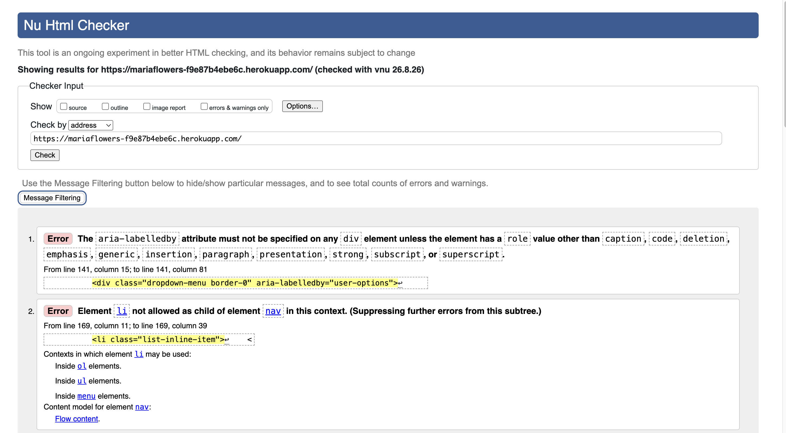<br><br>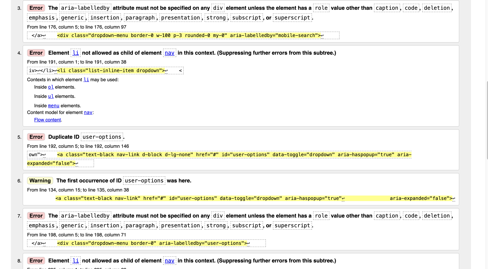 | Invalid `aria-labelledby` usage, invalid `<li>` placement inside `<nav>`, duplicate `user-options` ID, unnecessary JavaScript `type` attribute, and heading hierarchy issues. |  | **Pass after fixes** |
| accounts | Sign Up | [W3C Validator](https://validator.w3.org/nu/?doc=https://mariaflowers-f9e87b4ebe6c.herokuapp.com/accounts/signup/&out=html) |  | Page contained heading elements but no computed heading level 1. | 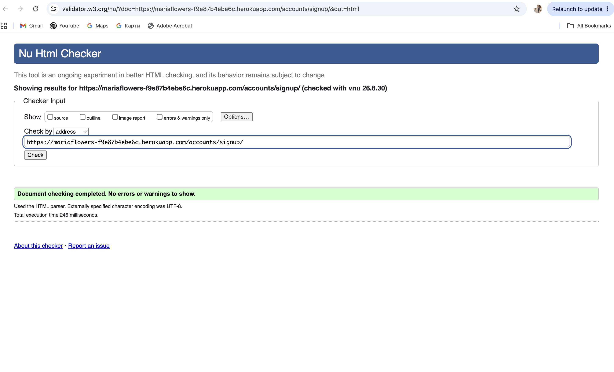 | **Fix implemented** |
| accounts | Login | [W3C Validator](https://validator.w3.org/nu/?doc=https://mariaflowers-f9e87b4ebe6c.herokuapp.com/accounts/login/&out=html) | 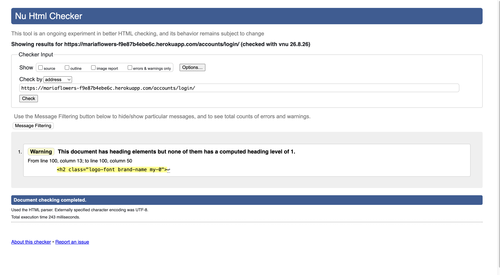 | Page contained heading elements but no computed heading level 1. |  | **Pass after fix** |
| accounts | Logout | [W3C HTML Checker](https://validator.w3.org/nu/#textarea) | 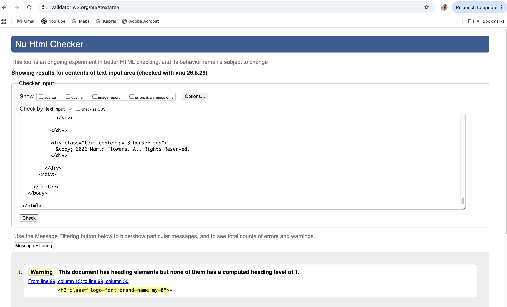 | Incorrect heading hierarchy was identified. |  | **Pass after fix** |
| accounts | Password Reset | [W3C HTML Checker](https://validator.w3.org/nu/#textarea) | 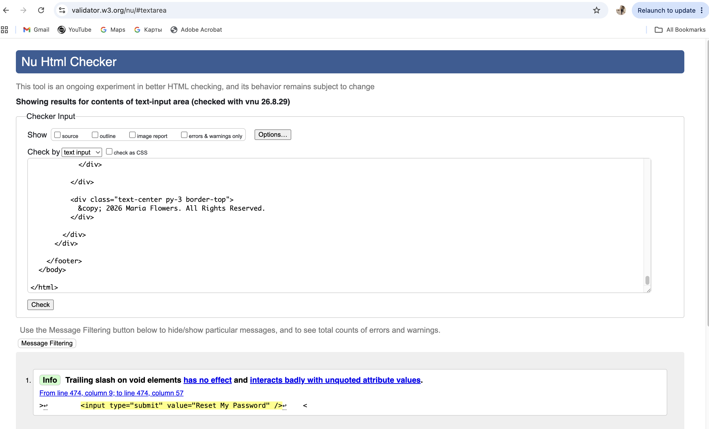 | HTML validation issue was identified in the password reset page. | 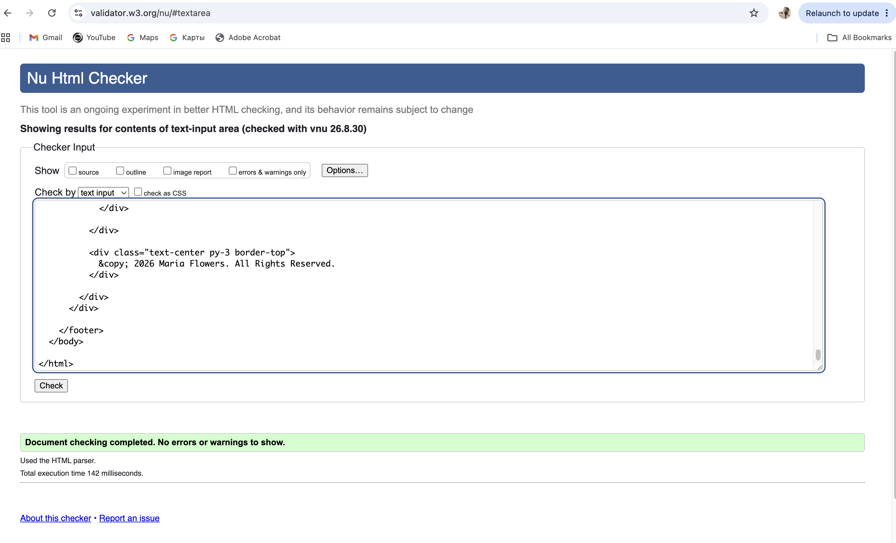 | **Pass after fix** |
| accounts | Password Reset Success | [W3C HTML Checker](https://validator.w3.org/nu/#textarea) | — | No validation issues remained in the final check. |  | **Pass** |
| bag | [bag.html](https://github.com/akashebaev-ux/mariaflowers/blob/main/bag/templates/bag/bag.html) | [W3C Validator](https://validator.w3.org/nu/?doc=https://mariaflowers-f9e87b4ebe6c.herokuapp.com/bag/&out=html) | 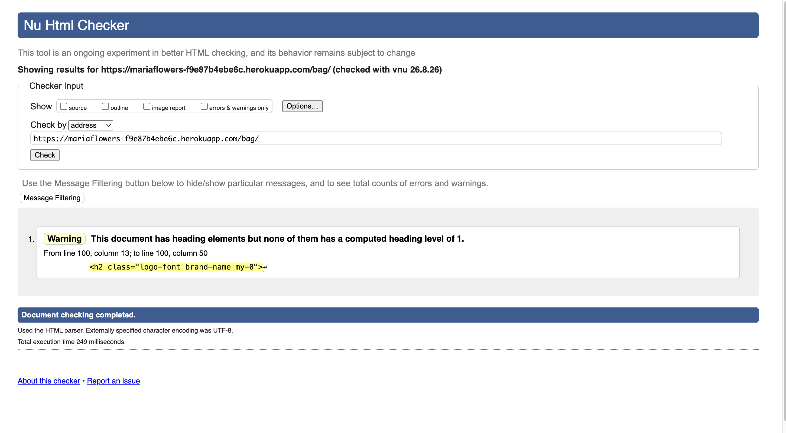 | Page contained heading elements but no computed heading level 1. | 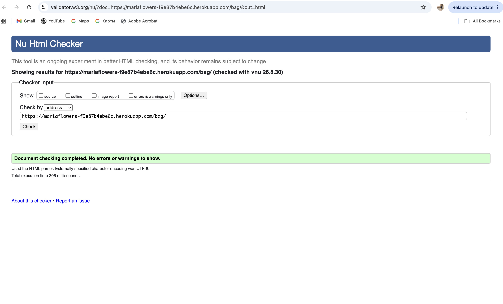 | **Fix implemented** |
| products | [products.html](https://github.com/akashebaev-ux/mariaflowers/blob/main/products/templates/products/products.html) | [W3C Validator](https://validator.w3.org/nu/?doc=https://mariaflowers-f9e87b4ebe6c.herokuapp.com/products/&out=html) | — | No remaining validation issues. |  | **Pass** |
| product detail | [product_detail.html](https://github.com/akashebaev-ux/mariaflowers/blob/main/products/templates/products/product_detail.html) | [W3C HTML Checker](https://validator.w3.org/nu/#textarea) | — | Rendered source was validated because the page contains Django template syntax and dynamic content. |  | **Pass** |
| product management | Product Management | [W3C HTML Checker](https://validator.w3.org/nu/#textarea) | — | Authenticated page; rendered page source was validated by input. |  | **Pass** |
| profiles | [profile.html](https://github.com/akashebaev-ux/mariaflowers/blob/main/profiles/templates/profiles/profile.html) | [W3C HTML Checker](https://validator.w3.org/nu/#textarea) | — | Authenticated page; rendered page source was validated by input. |  | **Pass** |
| checkout success | [checkout_success.html](https://github.com/akashebaev-ux/mariaflowers/blob/main/checkout/templates/checkout/checkout_success.html) | [W3C HTML Checker](https://validator.w3.org/nu/#textarea) | — | Rendered source was validated because the page contains dynamic Django content. |  | **Pass** |
| contact | [contact.html](https://github.com/akashebaev-ux/mariaflowers/blob/main/home/templates/home/contact.html) | [W3C Validator](https://validator.w3.org/nu/?doc=https://mariaflowers-f9e87b4ebe6c.herokuapp.com/contact/&out=html) | — | No remaining validation issues. |  | **Pass** |
| about | [about.html](https://github.com/akashebaev-ux/mariaflowers/blob/main/templates/about.html) | [W3C Validator](https://validator.w3.org/nu/?doc=https://mariaflowers-f9e87b4ebe6c.herokuapp.com/about/&out=html) | — | No remaining validation issues. |  | **Pass** |
| delivery policy | [delivery_policy.html](https://github.com/akashebaev-ux/mariaflowers/blob/main/templates/delivery_policy.html) | [W3C Validator](https://validator.w3.org/nu/?doc=https://mariaflowers-f9e87b4ebe6c.herokuapp.com/delivery-policy/&out=html) | — | No remaining validation issues. |  | **Pass** |
| FAQ | [faq.html](https://github.com/akashebaev-ux/mariaflowers/blob/main/templates/faq.html) | [W3C Validator](https://validator.w3.org/nu/?doc=https://mariaflowers-f9e87b4ebe6c.herokuapp.com/faq/&out=html) | 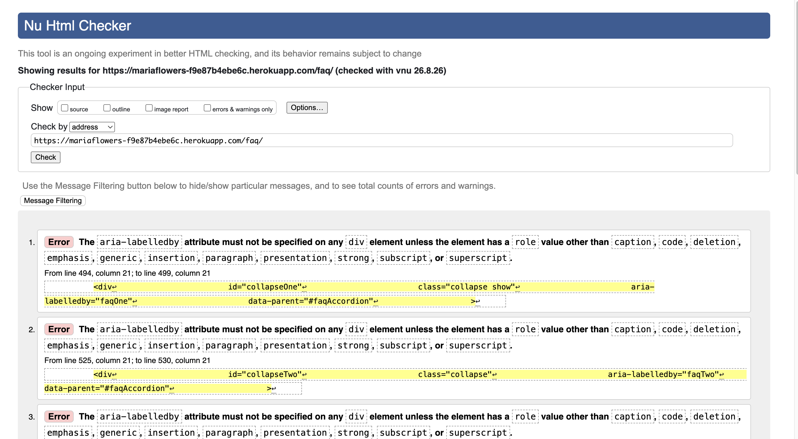<br><br>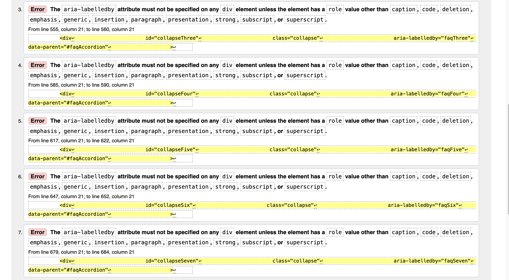 | Seven `aria-labelledby` validation errors were identified on the FAQ accordion collapse `<div>` elements. |  | **Pass after fixes** |
| gifts | Gifts | [W3C HTML Checker](https://validator.w3.org/nu/#textarea) | — | No remaining validation issues. |  | **Pass** |
| privacy policy | [privacy_policy.html](https://github.com/akashebaev-ux/mariaflowers/blob/main/templates/privacy_policy.html) | [W3C Validator](https://validator.w3.org/nu/?doc=https://mariaflowers-f9e87b4ebe6c.herokuapp.com/privacy-policy/&out=html) | — | No remaining validation issues. |  | **Pass** |
| refund policy | [refund_policy.html](https://github.com/akashebaev-ux/mariaflowers/blob/main/templates/refund_policy.html) | [W3C Validator](https://validator.w3.org/nu/?doc=https://mariaflowers-f9e87b4ebe6c.herokuapp.com/refunds/&out=html) | — | No remaining validation issues. |  | **Pass** |
| terms & conditions | [terms_conditions.html](https://github.com/akashebaev-ux/mariaflowers/blob/main/templates/terms_conditions.html) | [W3C Validator](https://validator.w3.org/nu/?doc=https://mariaflowers-f9e87b4ebe6c.herokuapp.com/terms-and-conditions/&out=html) | — | No remaining validation issues. | 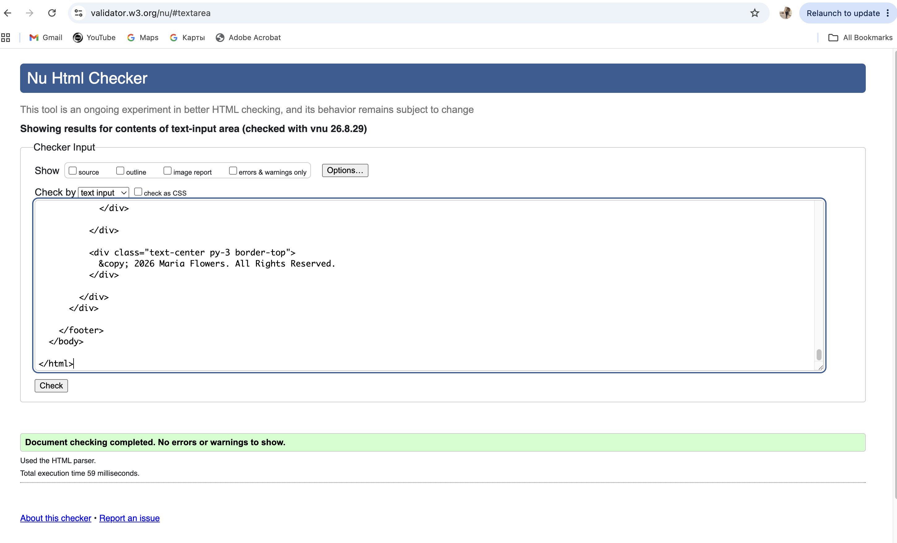 | **Pass** |
| 404 | [404.html](https://github.com/akashebaev-ux/mariaflowers/blob/main/templates/errors/404.html) | [W3C HTML Checker](https://validator.w3.org/nu/#textarea) | 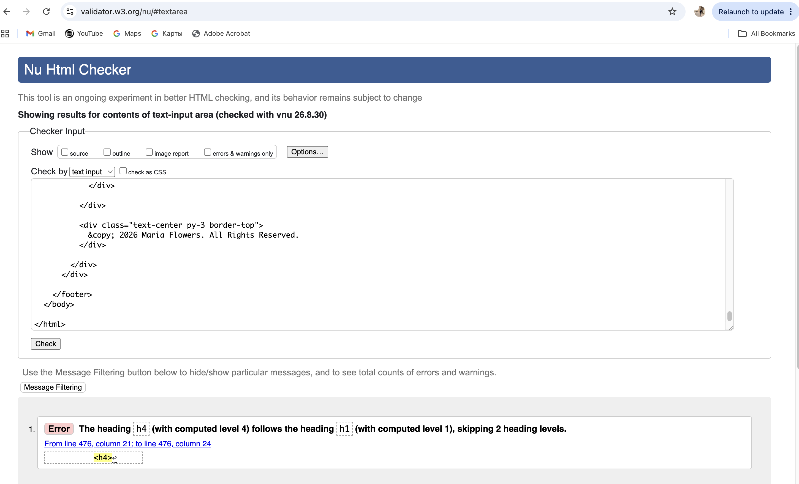 | An `h4` followed the page `h1`, skipping heading levels. The heading wrapper around the **Return to shop** action was removed. |  | **Pass after fix** |


### CSS


I have used the recommended
[W3C CSS Jigsaw Validator](https://jigsaw.w3.org/css-validator/)
to validate the custom CSS files used in the application.

#### Checkout CSS

File:
[checkout.css](https://github.com/akashebaev-ux/mariaflowers/blob/main/checkout/static/checkout/css/checkout.css)

Validator:
[W3C CSS Validator](https://jigsaw.w3.org/css-validator/#validate_by_input)

The `checkout.css` file was validated by input using the W3C CSS Validator.

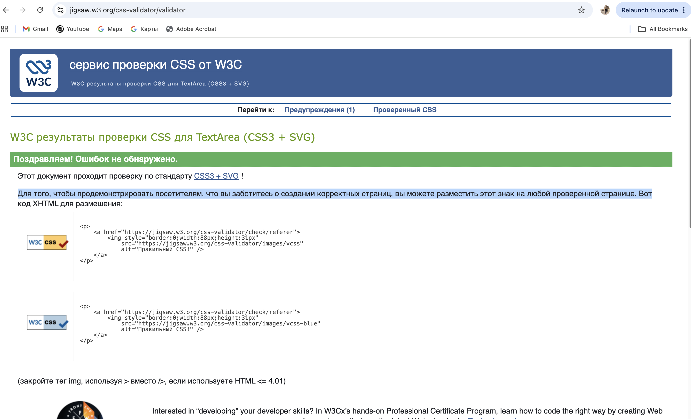

**Result: Pass — no errors found.**

---

#### Profile CSS

File:
[profile.css](https://github.com/akashebaev-ux/mariaflowers/blob/main/profiles/static/profiles/css/profile.css)

Validator:
[W3C CSS Validator](https://jigsaw.w3.org/css-validator/#validate_by_input)

The `profile.css` file was validated by input using the W3C CSS Validator.

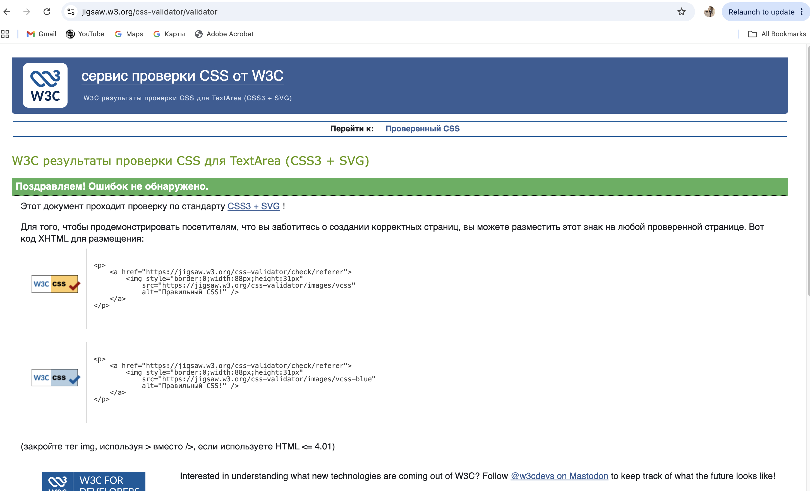

**Result: Pass — no errors found.**

---

#### Base CSS

File:
[base.css](https://github.com/akashebaev-ux/mariaflowers/blob/main/static/css/base.css)

Deployed CSS:
[base.css on AWS S3](https://mariaflowers.s3.amazonaws.com/static/css/base.css?v=2)

Validator:
[Validate deployed base.css](https://jigsaw.w3.org/css-validator/validator?uri=https://mariaflowers.s3.amazonaws.com/static/css/base.css?v=2&output=html)

The deployed `base.css` file was validated directly from the AWS S3 URL.

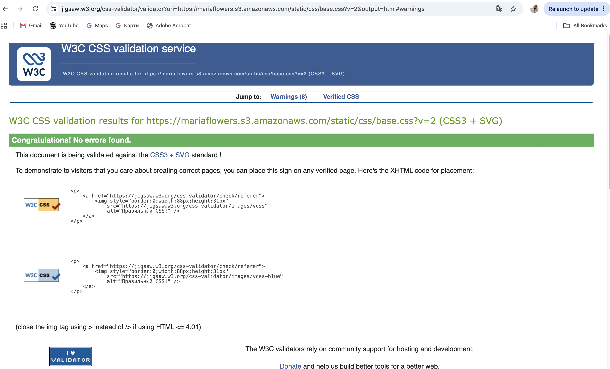

**Result: Pass — no CSS errors found.**

The validator also reported eight warnings relating to browser-specific
vendor extensions and browser-supported CSS values.

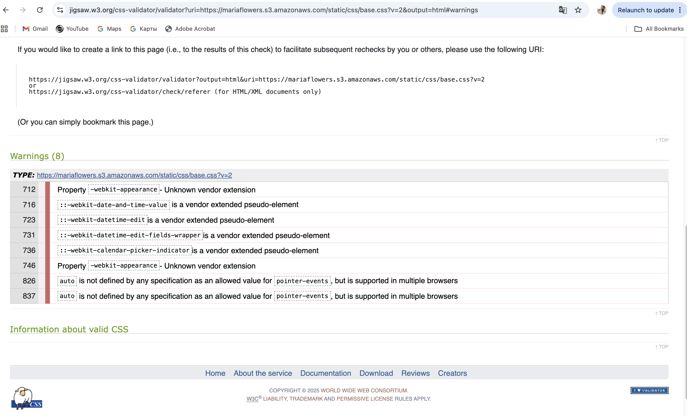

The warnings include:

- `-webkit-appearance` vendor extensions;
- WebKit-specific date and time pseudo-elements;
- WebKit calendar picker pseudo-elements;
- `pointer-events: auto` being supported by browsers but not defined as
  an allowed value by the validator's selected specification.

These warnings do not prevent the stylesheet from passing validation.
The validator confirms **"Congratulations! No errors found."**

---

#### CSS Validation Summary

| Directory | File | Validation | Screenshot | Result |
| --- | --- | --- | --- | --- |
| checkout | [checkout.css](https://github.com/akashebaev-ux/mariaflowers/blob/main/checkout/static/checkout/css/checkout.css) | [W3C CSS Validator](https://jigsaw.w3.org/css-validator/#validate_by_input) |  | **Pass — no errors** |
| profiles | [profile.css](https://github.com/akashebaev-ux/mariaflowers/blob/main/profiles/static/profiles/css/profile.css) | [W3C CSS Validator](https://jigsaw.w3.org/css-validator/#validate_by_input) |  | **Pass — no errors** |
| static | [base.css](https://github.com/akashebaev-ux/mariaflowers/blob/main/static/css/base.css) | [Validate deployed CSS](https://jigsaw.w3.org/css-validator/validator?uri=https://mariaflowers.s3.amazonaws.com/static/css/base.css?v=2&output=html) | <br><br> | **Pass — no errors, 8 warnings** |


### JavaScript Validation

JavaScript code was validated using [JSHint](https://jshint.com/).
During validation, warnings were identified relating mainly to ES6 syntax,
undefined global variables, and minor syntax/style issues.

Where appropriate, JSHint configuration comments were added to identify
the JavaScript version and external global variables used by the application.

#### Country Field

File: [countryfield.js](https://raw.githubusercontent.com/akashebaev-ux/mariaflowers/main/profiles/static/profiles/js/countryfield.js)  
Validator: [JSHint](https://jshint.com/)

The initial validation identified warnings because `let` requires ES6
configuration, `$` was not recognised as a defined global variable, and
an unnecessary semicolon was detected.

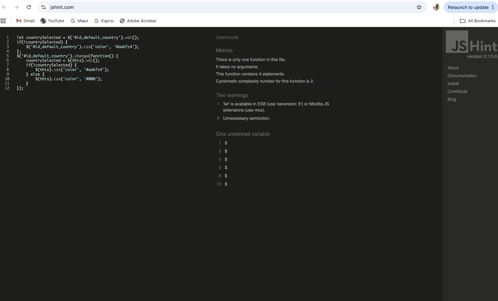

The file was updated to specify ES6 and declare jQuery's `$` as an
external global variable.

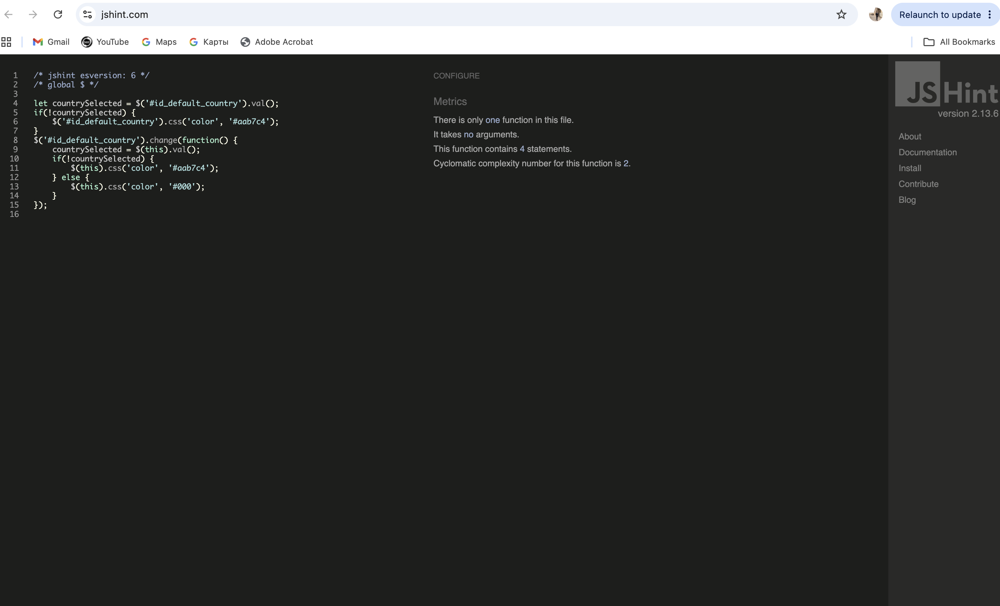

**Result: Pass**

#### Greeting Card

File: [greeting_card.js](https://raw.githubusercontent.com/akashebaev-ux/mariaflowers/main/products/static/products/greeting_card.js)  
Validator: [JSHint](https://jshint.com/)

The greeting card JavaScript initially produced JSHint warnings,
primarily because ES6 features such as `const`, `let`, and template
literals were being used without specifying the appropriate
ECMAScript version.

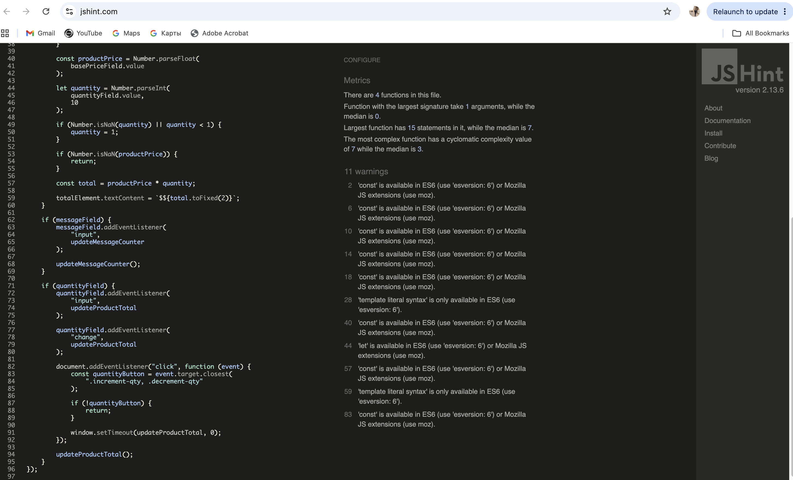

After configuring JSHint for ES6, the code passed without reported
warnings.

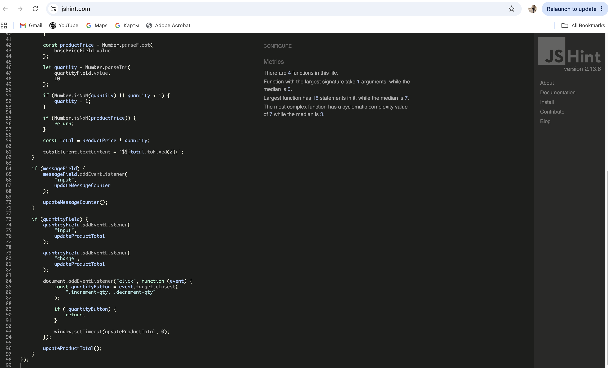

**Result: Pass**

#### Product Customisation

File: [product_customisation.js](https://raw.githubusercontent.com/akashebaev-ux/mariaflowers/main/products/static/products/product_customisation.js)  
Validator: [JSHint](https://jshint.com/)

The product customisation JavaScript initially produced multiple
warnings because ES6 features were used without the appropriate
JSHint configuration.

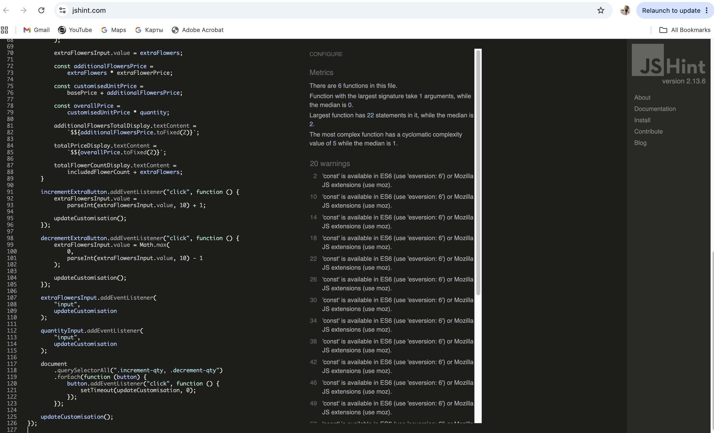

After configuring JSHint for ES6, the reported warnings were resolved.

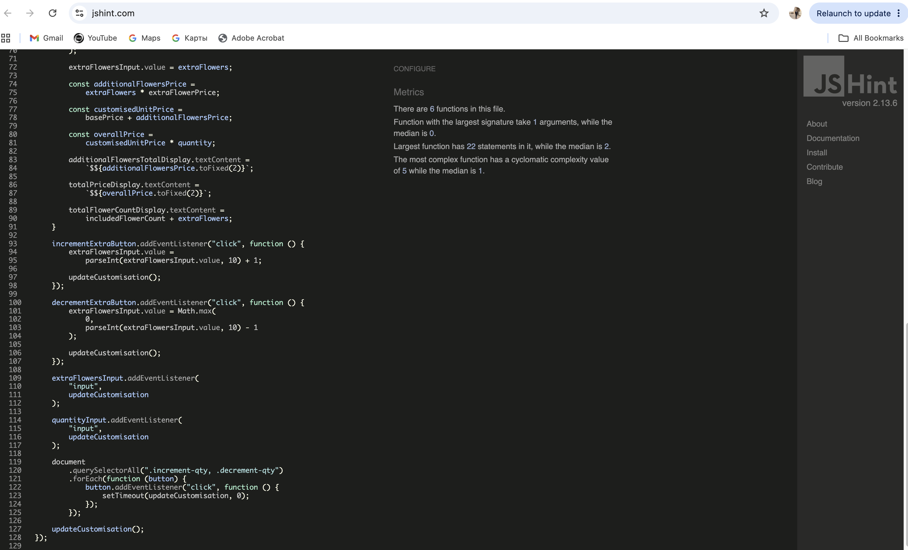

**Result: Pass**

#### Stripe Elements

File: [stripe_elements.js](https://raw.githubusercontent.com/akashebaev-ux/mariaflowers/main/checkout/static/checkout/js/stripe_elements.js)  
Validator: [JSHint](https://jshint.com/)

The Stripe checkout JavaScript initially produced warnings relating
to ES6 template literals, a missing semicolon, and the `$` global
variable used by jQuery.

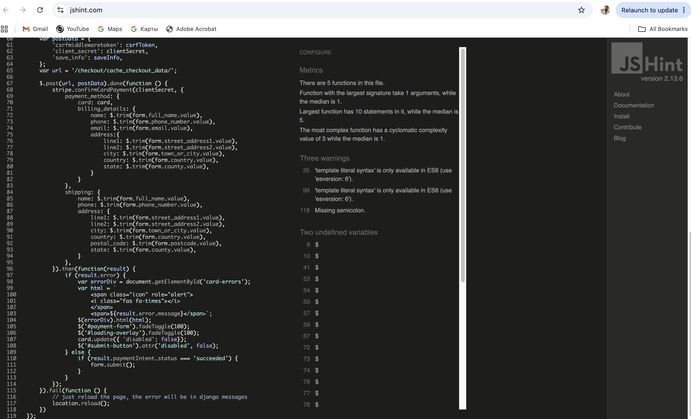

After correcting the reported issues and configuring the required
JavaScript environment/global variables, the code was revalidated.

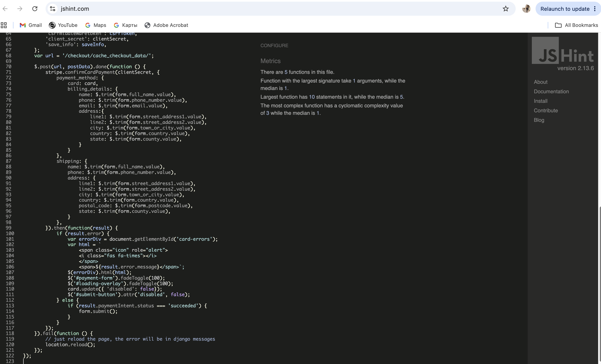

**Result: Pass**


**### Python**


I have used the recommended [PEP8 CI Python Linter](https://pep8ci.herokuapp.com) to validate all of my Python files.

| Directory | File | URL | Screenshot | Notes |
| --- | --- | --- | --- | --- |
| bag | [contexts.py](https://github.com/akashebaev-ux/mariaflowers/blob/main/bag/contexts.py) | [PEP8 CI Link](https://pep8ci.herokuapp.com/https://raw.githubusercontent.com/akashebaev-ux/mariaflowers/main/bag/contexts.py) | 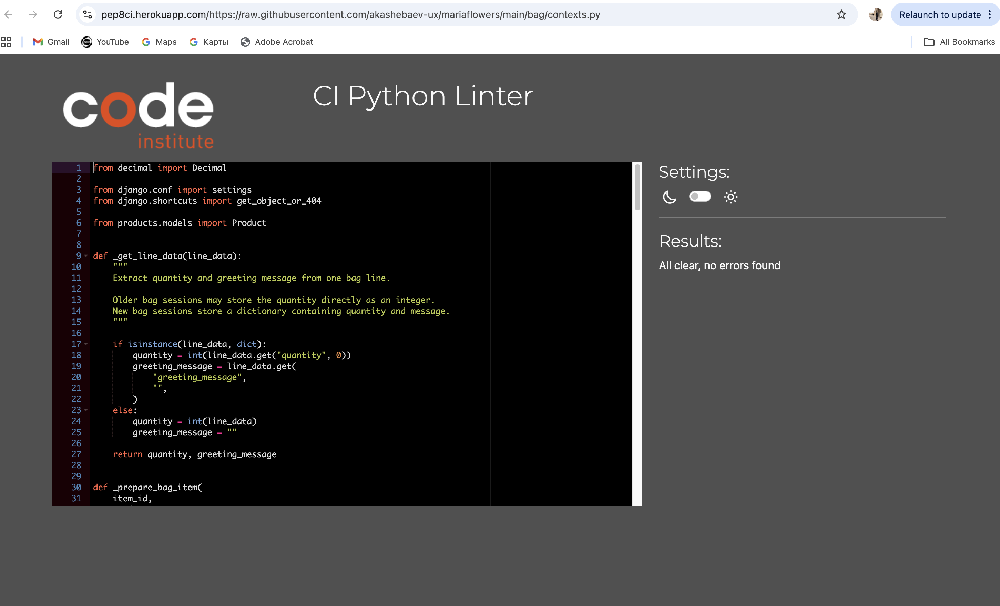 | **Pass — no errors found** |
| bag/templatetags | [bag\_tools.py](https://github.com/akashebaev-ux/mariaflowers/blob/main/bag/templatetags/bag_tools.py) | [PEP8 CI Link](https://pep8ci.herokuapp.com/https://raw.githubusercontent.com/akashebaev-ux/mariaflowers/main/bag/templatetags/bag_tools.py) | 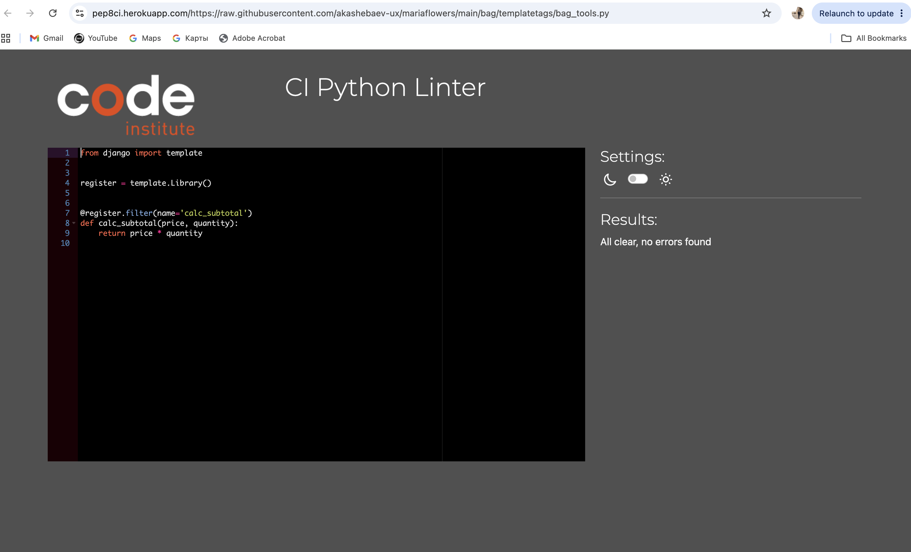 | **Pass — no errors found** |
| bag | [urls.py](https://github.com/akashebaev-ux/mariaflowers/blob/main/bag/urls.py) | [PEP8 CI Link](https://pep8ci.herokuapp.com/https://raw.githubusercontent.com/akashebaev-ux/mariaflowers/main/bag/urls.py) | 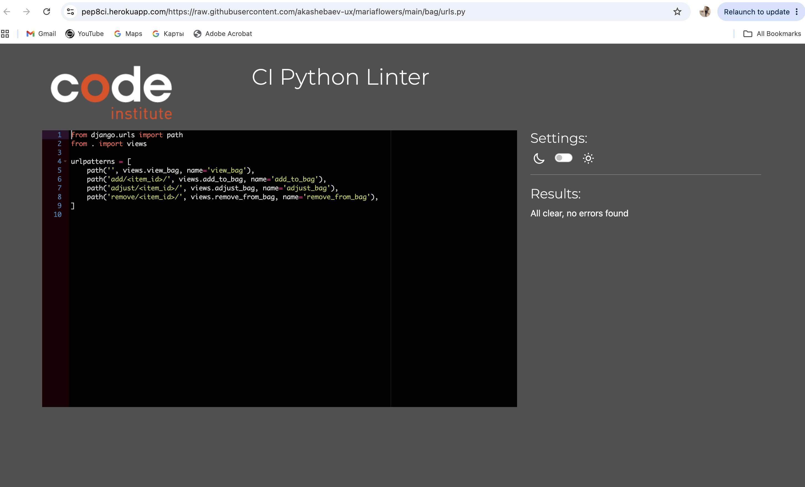 | **Pass — no errors found** |
| bag | [views.py](https://github.com/akashebaev-ux/mariaflowers/blob/main/bag/views.py) | [PEP8 CI Link](https://pep8ci.herokuapp.com/https://raw.githubusercontent.com/akashebaev-ux/mariaflowers/main/bag/views.py) | 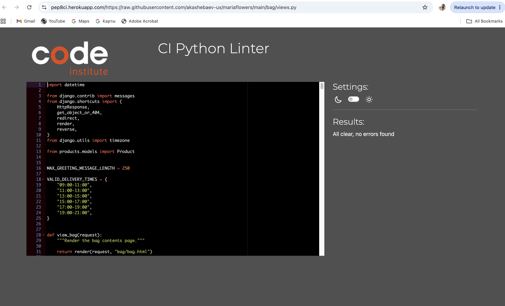 | **Pass — no errors found** |
| boutique\_ado | [settings.py](https://github.com/akashebaev-ux/mariaflowers/blob/main/boutique_ado/settings.py) | [PEP8 CI Link](https://pep8ci.herokuapp.com/https://raw.githubusercontent.com/akashebaev-ux/mariaflowers/main/boutique_ado/settings.py) | 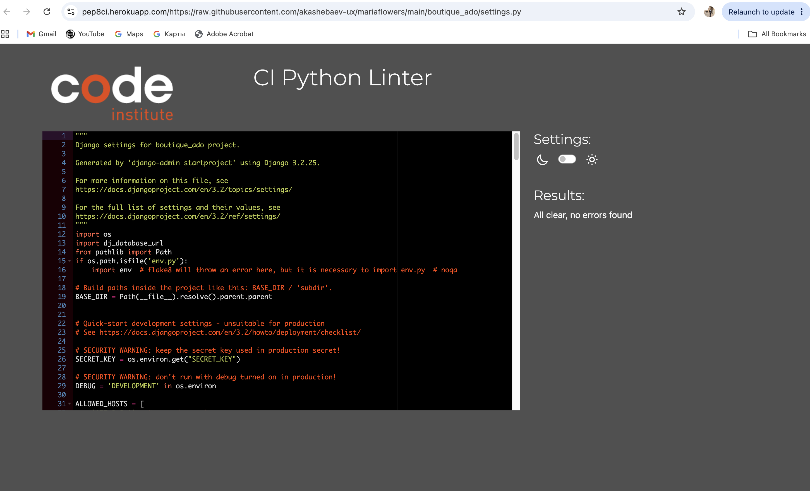 | **Pass — no errors found** |
| boutique\_ado | [urls.py](https://github.com/akashebaev-ux/mariaflowers/blob/main/boutique_ado/urls.py) | [PEP8 CI Link](https://pep8ci.herokuapp.com/https://raw.githubusercontent.com/akashebaev-ux/mariaflowers/main/boutique_ado/urls.py) | 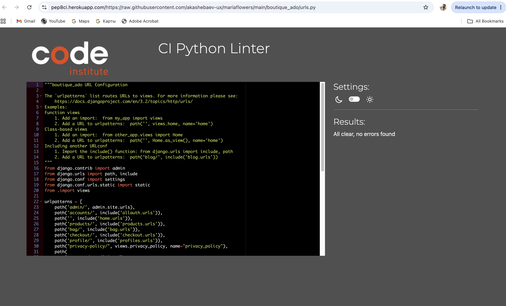 | **Pass — no errors found** |
| boutique\_ado | [views.py](https://github.com/akashebaev-ux/mariaflowers/blob/main/boutique_ado/views.py) | [PEP8 CI Link](https://pep8ci.herokuapp.com/https://raw.githubusercontent.com/akashebaev-ux/mariaflowers/main/boutique_ado/views.py) | 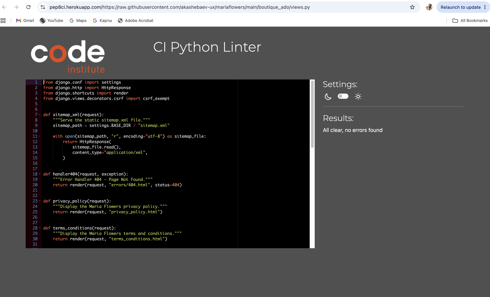 | **Pass — no errors found** |
| checkout | [admin.py](https://github.com/akashebaev-ux/mariaflowers/blob/main/checkout/admin.py) | [PEP8 CI Link](https://pep8ci.herokuapp.com/https://raw.githubusercontent.com/akashebaev-ux/mariaflowers/main/checkout/admin.py) | 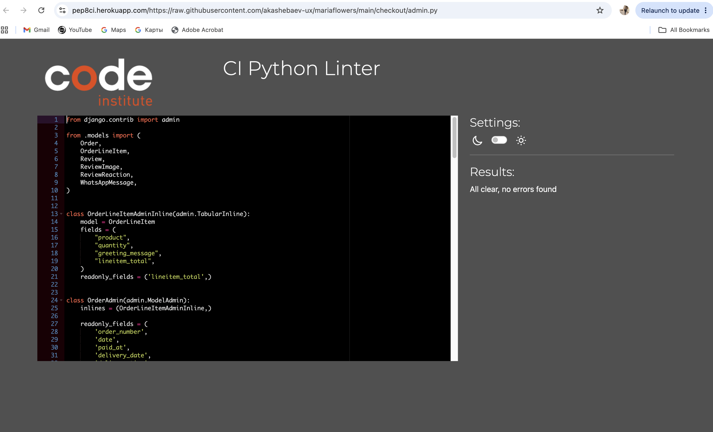 | **Pass — no errors found** |
| checkout | [forms.py](https://github.com/akashebaev-ux/mariaflowers/blob/main/checkout/forms.py) | [PEP8 CI Link](https://pep8ci.herokuapp.com/https://raw.githubusercontent.com/akashebaev-ux/mariaflowers/main/checkout/forms.py) | 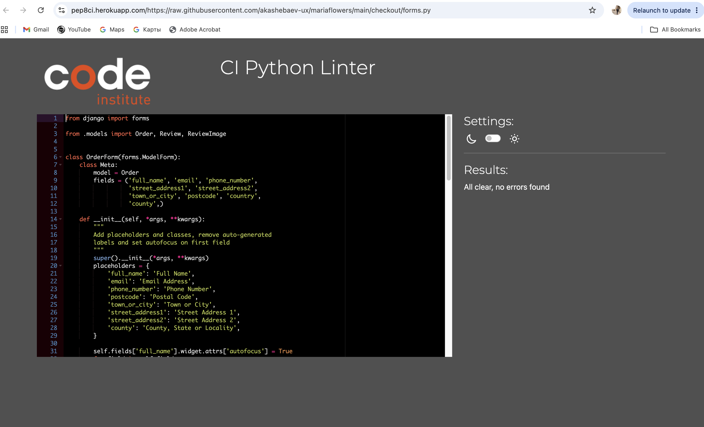 | **Pass — no errors found** |
| checkout/management/commands | [complete\_expired\_orders.py](https://github.com/akashebaev-ux/mariaflowers/blob/main/checkout/management/commands/complete_expired_orders.py) | [PEP8 CI Link](https://pep8ci.herokuapp.com/https://raw.githubusercontent.com/akashebaev-ux/mariaflowers/main/checkout/management/commands/complete_expired_orders.py) | 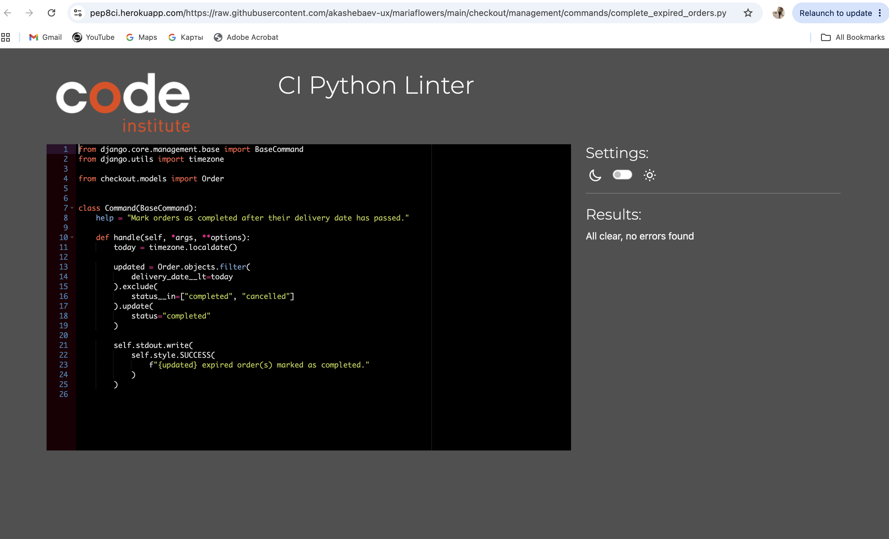 | **Pass — no errors found** |
| checkout | [models.py](https://github.com/akashebaev-ux/mariaflowers/blob/main/checkout/models.py) | [PEP8 CI Link](https://pep8ci.herokuapp.com/https://raw.githubusercontent.com/akashebaev-ux/mariaflowers/main/checkout/models.py) | 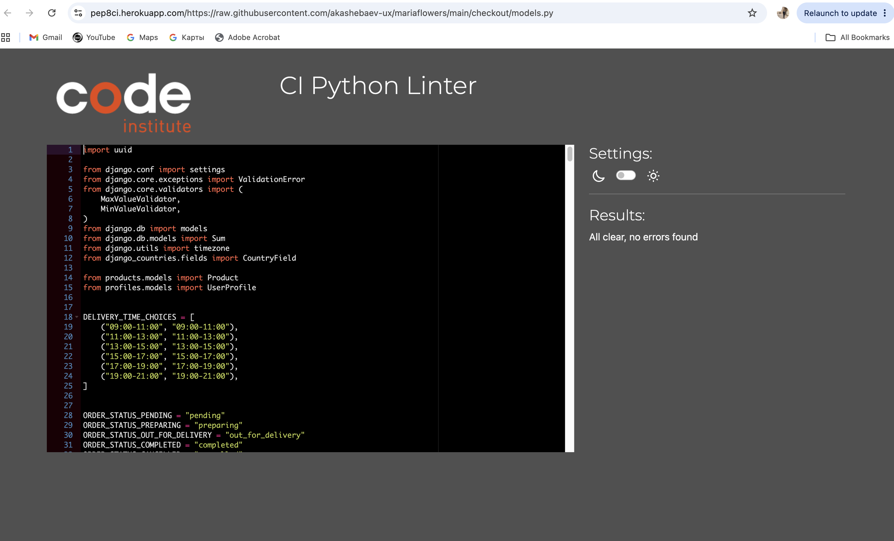 | **Pass — no errors found** |
| checkout | [signals.py](https://github.com/akashebaev-ux/mariaflowers/blob/main/checkout/signals.py) | [PEP8 CI Link](https://pep8ci.herokuapp.com/https://raw.githubusercontent.com/akashebaev-ux/mariaflowers/main/checkout/signals.py) | 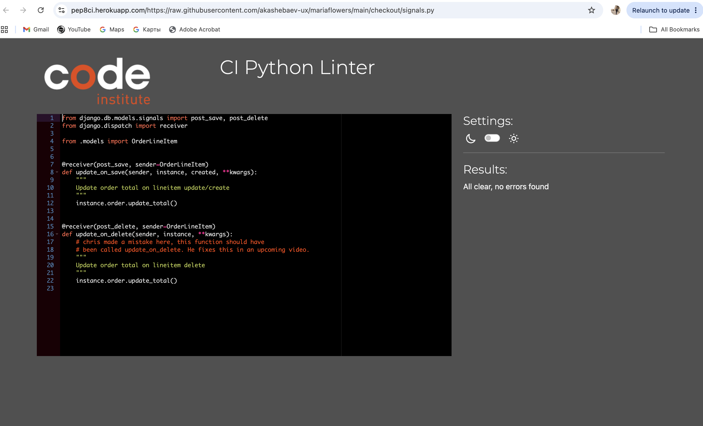 | **Pass — no errors found** |
| checkout | [tests.py](https://github.com/akashebaev-ux/mariaflowers/blob/main/checkout/tests.py) | [PEP8 CI Link](https://pep8ci.herokuapp.com/https://raw.githubusercontent.com/akashebaev-ux/mariaflowers/main/checkout/tests.py) | 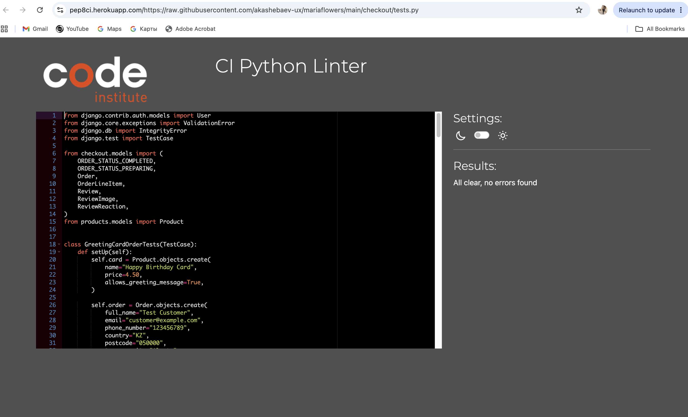 | **Pass — no errors found** |
| checkout | [urls.py](https://github.com/akashebaev-ux/mariaflowers/blob/main/checkout/urls.py) | [PEP8 CI Link](https://pep8ci.herokuapp.com/https://raw.githubusercontent.com/akashebaev-ux/mariaflowers/main/checkout/urls.py) | 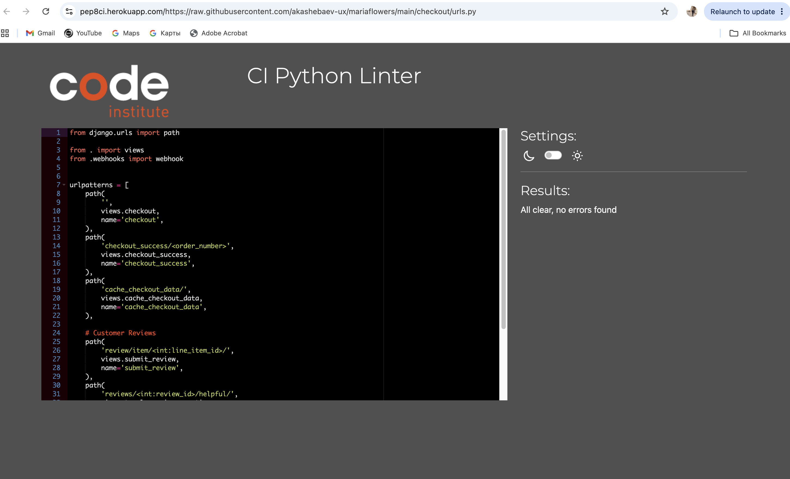 | **Pass — no errors found** |
| checkout | [views.py](https://github.com/akashebaev-ux/mariaflowers/blob/main/checkout/views.py) | [PEP8 CI Link](https://pep8ci.herokuapp.com/https://raw.githubusercontent.com/akashebaev-ux/mariaflowers/main/checkout/views.py) | 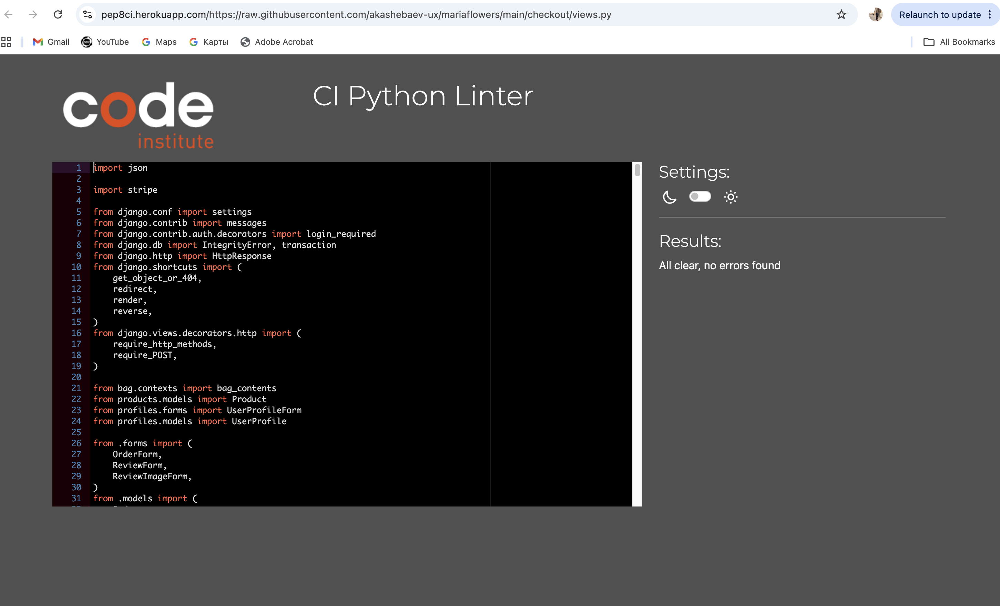 | **Pass — no errors found** |
| checkout | [webhook\_handler.py](https://github.com/akashebaev-ux/mariaflowers/blob/main/checkout/webhook_handler.py) | [PEP8 CI Link](https://pep8ci.herokuapp.com/https://raw.githubusercontent.com/akashebaev-ux/mariaflowers/main/checkout/webhook_handler.py) | 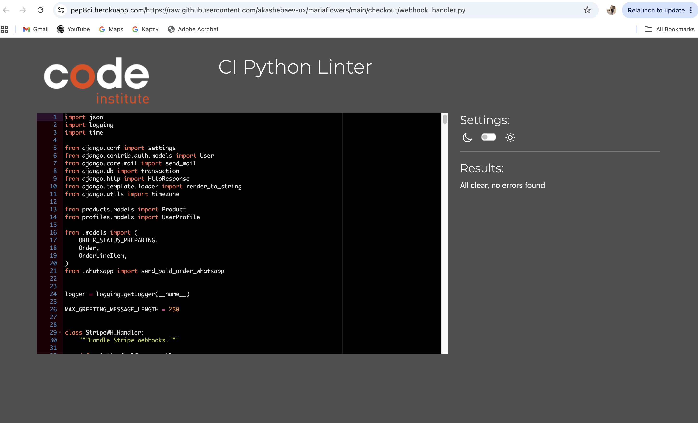 | **Pass — no errors found** |
| checkout | [webhooks.py](https://github.com/akashebaev-ux/mariaflowers/blob/main/checkout/webhooks.py) | [PEP8 CI Link](https://pep8ci.herokuapp.com/https://raw.githubusercontent.com/akashebaev-ux/mariaflowers/main/checkout/webhooks.py) | 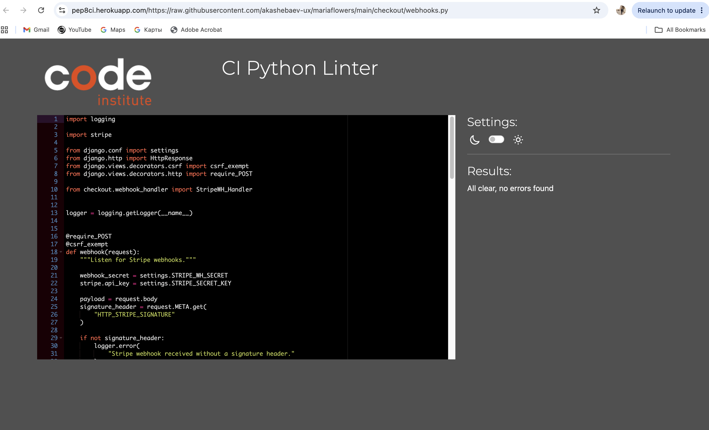 | **Pass — no errors found** |
| checkout | [whatsapp.py](https://github.com/akashebaev-ux/mariaflowers/blob/main/checkout/whatsapp.py) | [PEP8 CI Link](https://pep8ci.herokuapp.com/https://raw.githubusercontent.com/akashebaev-ux/mariaflowers/main/checkout/whatsapp.py) |  | **Pass — no errors found** |
|  | [custom\_storages.py](https://github.com/akashebaev-ux/mariaflowers/blob/main/custom_storages.py) | [PEP8 CI Link](https://pep8ci.herokuapp.com/https://raw.githubusercontent.com/akashebaev-ux/mariaflowers/main/custom_storages.py) | 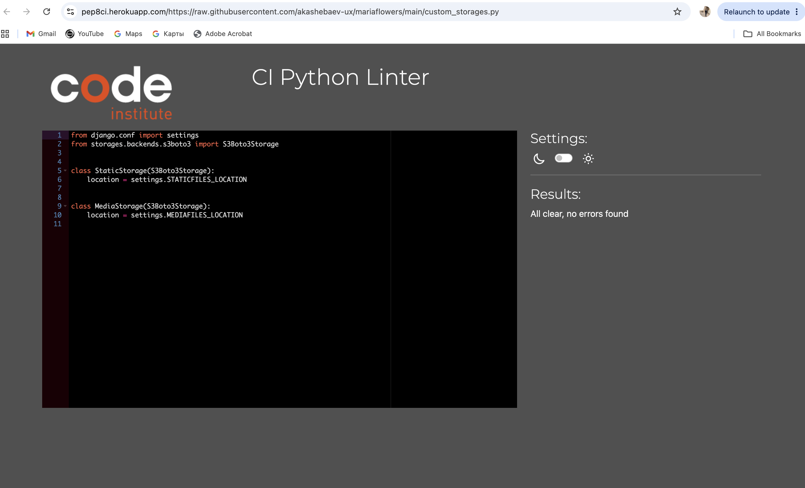 | **Pass — no errors found** |
| home | [admin.py](https://github.com/akashebaev-ux/mariaflowers/blob/main/home/admin.py) | [PEP8 CI Link](https://pep8ci.herokuapp.com/https://raw.githubusercontent.com/akashebaev-ux/mariaflowers/main/home/admin.py) | 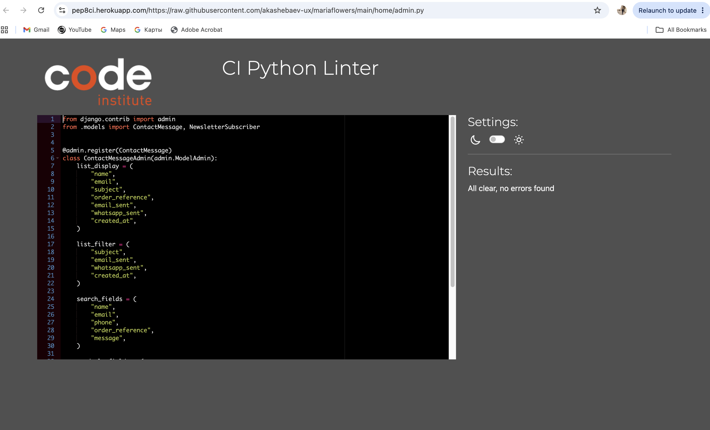 | **Pass — no errors found** |
| home | [forms.py](https://github.com/akashebaev-ux/mariaflowers/blob/main/home/forms.py) | [PEP8 CI Link](https://pep8ci.herokuapp.com/https://raw.githubusercontent.com/akashebaev-ux/mariaflowers/main/home/forms.py) | 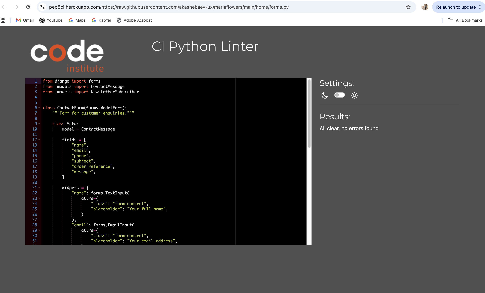 | **Pass — no errors found** |
| home | [models.py](https://github.com/akashebaev-ux/mariaflowers/blob/main/home/models.py) | [PEP8 CI Link](https://pep8ci.herokuapp.com/https://raw.githubusercontent.com/akashebaev-ux/mariaflowers/main/home/models.py) | 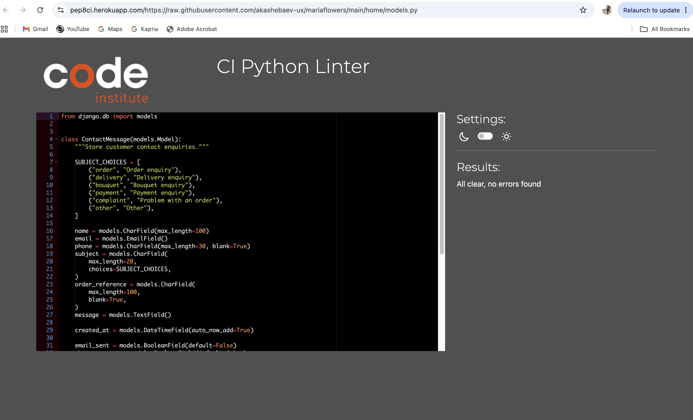 | **Pass — no errors found** |
| home | [urls.py](https://github.com/akashebaev-ux/mariaflowers/blob/main/home/urls.py) | [PEP8 CI Link](https://pep8ci.herokuapp.com/https://raw.githubusercontent.com/akashebaev-ux/mariaflowers/main/home/urls.py) | 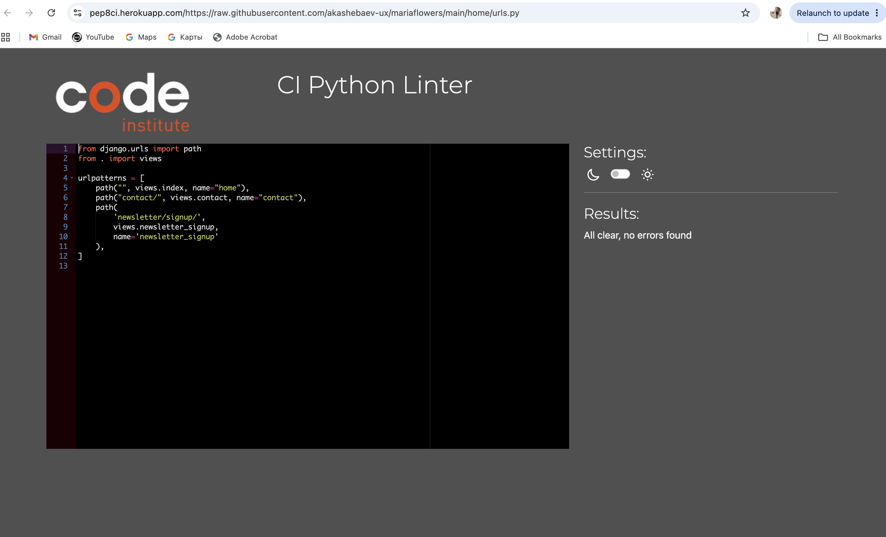 | **Pass — no errors found** |
| home | [views.py](https://github.com/akashebaev-ux/mariaflowers/blob/main/home/views.py) | [PEP8 CI Link](https://pep8ci.herokuapp.com/https://raw.githubusercontent.com/akashebaev-ux/mariaflowers/main/home/views.py) | 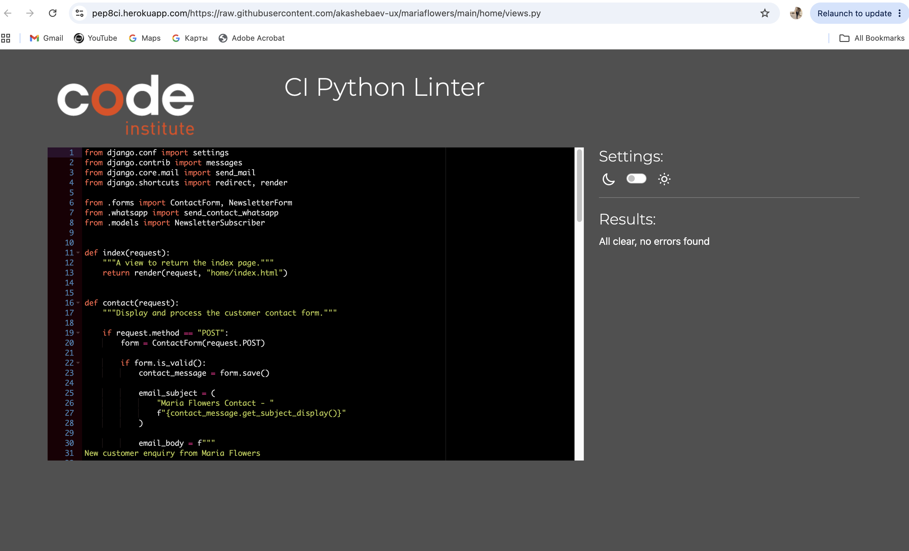 | **Pass — no errors found** |
| home | [whatsapp.py](https://github.com/akashebaev-ux/mariaflowers/blob/main/home/whatsapp.py) | [PEP8 CI Link](https://pep8ci.herokuapp.com/https://raw.githubusercontent.com/akashebaev-ux/mariaflowers/main/home/whatsapp.py) | 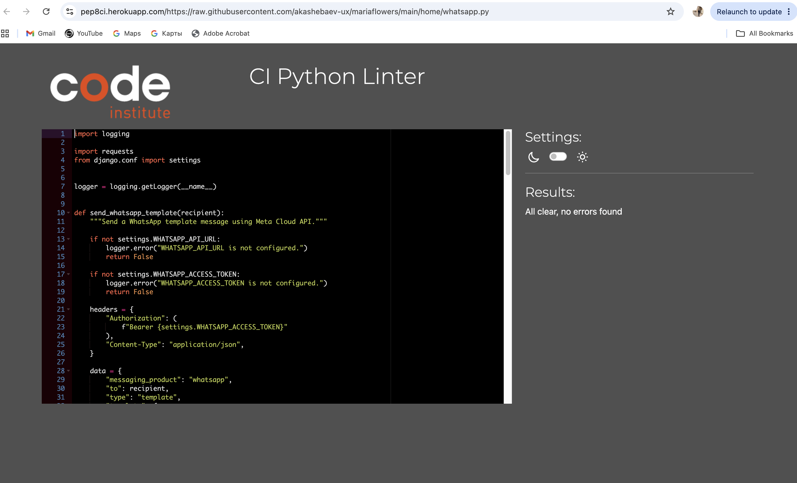 | **Pass — no errors found** |
|  | [manage.py](https://github.com/akashebaev-ux/mariaflowers/blob/main/manage.py) | [PEP8 CI Link](https://pep8ci.herokuapp.com/https://raw.githubusercontent.com/akashebaev-ux/mariaflowers/main/manage.py) | 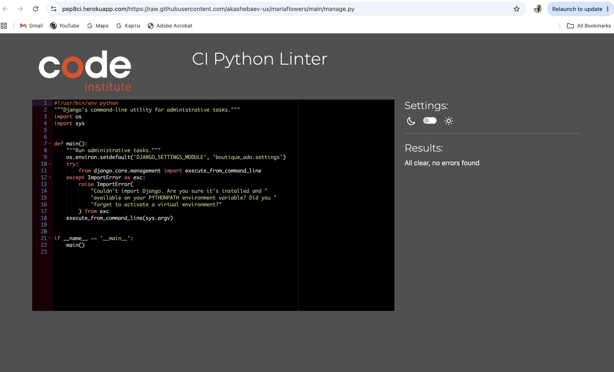 | **Pass — no errors found** |
| products | [admin.py](https://github.com/akashebaev-ux/mariaflowers/blob/main/products/admin.py) | [PEP8 CI Link](https://pep8ci.herokuapp.com/https://raw.githubusercontent.com/akashebaev-ux/mariaflowers/main/products/admin.py) |  | **Pass — no errors found** |
| products | [forms.py](https://github.com/akashebaev-ux/mariaflowers/blob/main/products/forms.py) | [PEP8 CI Link](https://pep8ci.herokuapp.com/https://raw.githubusercontent.com/akashebaev-ux/mariaflowers/main/products/forms.py) |  | **Pass — no errors found** |
| products | [models.py](https://github.com/akashebaev-ux/mariaflowers/blob/main/products/models.py) | [PEP8 CI Link](https://pep8ci.herokuapp.com/https://raw.githubusercontent.com/akashebaev-ux/mariaflowers/main/products/models.py) |  | **Pass — no errors found** |
| products | [urls.py](https://github.com/akashebaev-ux/mariaflowers/blob/main/products/urls.py) | [PEP8 CI Link](https://pep8ci.herokuapp.com/https://raw.githubusercontent.com/akashebaev-ux/mariaflowers/main/products/urls.py) |  | **Pass — no errors found** |
| products | [views.py](https://github.com/akashebaev-ux/mariaflowers/blob/main/products/views.py) | [PEP8 CI Link](https://pep8ci.herokuapp.com/https://raw.githubusercontent.com/akashebaev-ux/mariaflowers/main/products/views.py) |  | **Pass — no errors found** |
| products | [widgets.py](https://github.com/akashebaev-ux/mariaflowers/blob/main/products/widgets.py) | [PEP8 CI Link](https://pep8ci.herokuapp.com/https://raw.githubusercontent.com/akashebaev-ux/mariaflowers/main/products/widgets.py) |  | **Pass — no errors found** |
| profiles | [forms.py](https://github.com/akashebaev-ux/mariaflowers/blob/main/profiles/forms.py) | [PEP8 CI Link](https://pep8ci.herokuapp.com/https://raw.githubusercontent.com/akashebaev-ux/mariaflowers/main/profiles/forms.py) |  | **Pass — no errors found** |
| profiles | [models.py](https://github.com/akashebaev-ux/mariaflowers/blob/main/profiles/models.py) | [PEP8 CI Link](https://pep8ci.herokuapp.com/https://raw.githubusercontent.com/akashebaev-ux/mariaflowers/main/profiles/models.py) |  | **Pass — no errors found** |
| profiles | [urls.py](https://github.com/akashebaev-ux/mariaflowers/blob/main/profiles/urls.py) | [PEP8 CI Link](https://pep8ci.herokuapp.com/https://raw.githubusercontent.com/akashebaev-ux/mariaflowers/main/profiles/urls.py) |  | **Pass — no errors found** |
| profiles | [views.py](https://github.com/akashebaev-ux/mariaflowers/blob/main/profiles/views.py) | [PEP8 CI Link](https://pep8ci.herokuapp.com/https://raw.githubusercontent.com/akashebaev-ux/mariaflowers/main/profiles/views.py) |  | **Pass — no errors found** |


## Responsiveness

The deployed **Maria Flowers** website was manually tested on different screen sizes to check that the layout remains usable and visually consistent across **mobile, tablet, and desktop devices**.

Testing was carried out on the **live deployed website** using Chrome Developer Tools and built-in device emulation.

The following device sizes were used during testing:

- **Mobile:** iPhone 12 Pro
- **Mobile:** iPhone 16 Pro Max
- **Tablet:** iPad Air
- **Desktop:** MacBook Air / laptop viewport

The purpose of this testing was to confirm that important elements such as navigation, product cards, images, forms, buttons, and page layouts adapt correctly to different screen widths.

| Page | Mobile | Tablet | Desktop | Notes |
| --- | --- | --- | --- | --- |
| Home |  |  |  | Hero section displays correctly on desktop |
| Products |  |  | | Product grid adapts from a single-column mobile layout to a multi-column tablet layout |
| Product Details |  |  | | Product image and product information stack correctly on smaller screens |

### Mobile Testing

The website was tested using mobile device emulation, including **iPhone 12 Pro** and **iPhone 16 Pro Max** screen sizes.

On mobile devices, the main desktop navigation is replaced by a compact navigation bar containing the menu button, search option, account link, and shopping bag.

The Products page changes to a single-column layout so that each product card has enough space for the image, product name, price, category, rating, and management controls.

The Product Details page also changes to a vertical layout. The product image uses the available screen width and the product information is displayed below the image rather than beside it.

No unwanted horizontal scrolling was observed in the tested mobile layouts.

### Tablet Testing

The website was also tested using an **iPad Air** viewport.

The Products page makes use of the additional tablet screen width by displaying products in two columns.

Images and product information remain readable, and the navigation changes appropriately for the available screen size.

The tablet layout provides a useful transition between the single-column mobile layout and the wider desktop layout.

### Desktop Testing

Desktop testing was carried out using a laptop-sized viewport.

The Home page uses the larger available width to display the introductory text and call-to-action buttons alongside the main promotional image.

The full desktop navigation, search bar, account link, shopping bag, promotional banner, hero content, and footer remain correctly aligned.

### Responsive Behaviour Observed

During testing, the following responsive behaviour was confirmed:

- Navigation changes appropriately between mobile and desktop layouts.
- Product cards resize and rearrange depending on the available width.
- Product images scale without overflowing their containers.
- Product information remains readable on small screens.
- Buttons remain accessible and appropriately sized.
- The promotional delivery banner remains visible across screen sizes.
- The footer remains accessible at the bottom of the page.
- Product grids change from one column on mobile to multiple columns on larger screens.
- No significant horizontal overflow was found on the tested pages.

### Result

The current responsiveness tests confirm that the Maria Flowers layout adapts correctly across the tested **mobile, tablet, and desktop** screen sizes.


## Browser Compatibility

I've tested my deployed project on multiple browsers to check for compatibility issues.

The website was tested using Google Chrome, Mozilla Firefox and Safari on laptop/desktop devices. The main pages were checked for layout consistency, navigation, forms, product displays, shopping bag functionality and checkout presentation.

| Page | Chrome | Firefox | Safari | Notes |
| --- | --- | --- | --- | --- |
| Home |  |  |  | Works as expected |
| Products |  |  | | Works as expected |
| Gifts |  |  |  | Works as expected |
| Product Details |  |  | | Works as expected |
| Shopping Bag |  |  |  | Works as expected |
| Checkout |  |  |  | Works as expected |
| Sign Up |  |  |  | Works as expected |
| Login |  |  | | Works as expected |
| Contact |  |  |  | Works as expected |
| Footer |  | |  | Works as expected |

### Browser Compatibility Result

No major browser compatibility issues were identified during testing.

- Navigation displayed correctly across the tested browsers.
- Product images and product grids remained correctly aligned.
- Product detail pages maintained their intended layout.
- Shopping bag quantity controls remained usable.
- Checkout forms and order summaries displayed correctly.
- Sign-up and login forms remained properly aligned.
- Contact forms displayed correctly.
- The expandable customer service footer remained functional.
- No obvious horizontal overflow or overlapping content was observed.


## Lighthouse Audit

The deployed Maria Flowers website was tested using **Google Chrome Lighthouse** to identify potential issues relating to **Performance, Accessibility, Best Practices, and SEO**.

All Lighthouse tests were carried out on the **deployed version of the website** rather than the local development environment, as testing locally can produce different performance results.

Lighthouse audits were carried out using both **Mobile** and **Desktop** modes. Mobile Lighthouse scores are generally lower because Lighthouse simulates a slower mobile device, reduced CPU performance, and a slower network connection.

The website contains a mixture of informational pages, product pages, authenticated pages, forms, high-resolution product images, and third-party integrations. Therefore, Lighthouse results vary between different areas of the application.

| Page | Mobile | Desktop |
| --- | --- | --- |
| Register |  |  |
| Login |  |  |
| Logout |  |  |
| Password Reset |  |  |
| Profile |  |  |
| Home |   |  |
| About |  |  |
| Products |  |  |
| Gifts |  |  |
| Product Details |  |  |
| Bag |  |  |
| Checkout |  |  |
| Checkout Success |  |  |
| Add Product |  |  |
| Product Review |  |  |
| Contact |  |  |
| FAQ |  |  |
| Delivery Policy |  |  |
| Privacy Policy |  |  |
| Refund Policy |  |  |
| Terms & Conditions |  |  |

### Desktop Lighthouse Results

The following scores were recorded during Desktop Lighthouse testing of the deployed Maria Flowers website.

| Page | Performance | Accessibility | Best Practices | SEO |
| --- | ---: | ---: | ---: | ---: |
| Home | 87 | 100 | 100 | 100 |
| About | 95 | 100 | 100 | 100 |
| Products | 70 | 95 | 100 | 91 |
| Gifts | 75 | 95 | 100 | 91 |
| Product Details | 81 | 95 | 100 | 100 |
| Bag | 81 | 86 | 100 | 91 |
| Checkout | 75 | 89 | 77 | 100 |
| Checkout Success | 82 | 100 | 100 | 100 |
| Add Product | 96 | 95 | 100 | 100 |
| Product Review | 82 | 96 | 100 | 100 |
| Contact | 97 | 100 | 100 | 100 |
| FAQ | 86 | 96 | 100 | 100 |
| Delivery Policy | 86 | 96 | 100 | 100 |
| Privacy Policy | 82 | 100 | 100 | 100 |
| Refund Policy | 97 | 96 | 100 | 100 |
| Terms & Conditions | 91 | 96 | 100 | 100 |

### Lighthouse Results Analysis

Overall, Lighthouse testing showed strong results across the Maria Flowers website, particularly for **Accessibility, Best Practices, and SEO**.

Many pages achieved scores of **95–100** in Accessibility and **100** in Best Practices and SEO.

Performance scores varied more significantly because different pages contain different types and quantities of resources.

For example, the **Products** and **Gifts** pages display multiple high-resolution product images at the same time. Loading and rendering these images increases the amount of data required by the browser and can therefore result in lower Performance scores.

The **Product Details** page also contains a large product image together with interactive elements such as quantity selection, product customisation, delivery options, and customer reviews. As a result, it requires more resources than simpler informational pages.

### Mobile Lighthouse Results

Mobile Lighthouse Performance scores were generally lower than Desktop results.

This is expected because Lighthouse Mobile mode simulates a less powerful mobile device and applies CPU and network throttling.

Some informational pages achieved Mobile Performance scores in the high 50s while still receiving excellent Accessibility, Best Practices, and SEO results.

This indicates that the lower mobile Performance scores are primarily associated with loading and rendering resources under simulated mobile conditions rather than major structural or accessibility problems.

### Checkout Lighthouse Results

The **Checkout** page received lower Lighthouse results than many of the other pages, particularly for **Performance** and **Best Practices**.

This is partly because the checkout process uses **third-party functionality**, most importantly the **Stripe payment integration**.

Stripe loads external JavaScript and secure payment components that are not part of the Maria Flowers codebase. Stripe also uses secure iframe-based payment components and additional security functionality required to process payments safely.

These external resources can increase:

- JavaScript execution time.
- Network requests.
- Main-thread activity.
- Page loading time.
- Third-party resource usage.

As a result, they can have an impact on the Lighthouse Performance and Best Practices scores.

Lighthouse may also identify warnings relating to third-party scripts, browser APIs, cookies, security mechanisms, CAPTCHA or bot-detection functionality, and deprecated functionality contained within externally loaded libraries.

Because this code is supplied and maintained by third-party providers, these particular warnings cannot always be corrected directly within the Maria Flowers project.

The lower Checkout Lighthouse score therefore does not necessarily indicate a problem with the project's own HTML, CSS, Python, or JavaScript implementation.

Removing Stripe or its required security resources simply to increase the Lighthouse score would remove essential secure payment functionality and would therefore not be an appropriate optimisation.

The reported issues were reviewed during testing, and the checkout process was manually tested to confirm that:

- Customer information can be entered correctly.
- Form validation works as expected.
- Stripe payment functionality loads correctly.
- Payments can be processed.
- Orders are created successfully.
- Customers are redirected to the Checkout Success page after a successful transaction.

### Performance Considerations

Several factors can influence Lighthouse Performance scores across the website:

- High-resolution product and promotional images.
- Multiple images displayed simultaneously on product listing pages.
- External JavaScript resources.
- Stripe payment functionality.
- Third-party security functionality.
- Font and icon resources.
- Browser and network conditions at the time of testing.
- Mobile CPU and network throttling applied automatically by Lighthouse.
- Dynamic Django content and database queries.
- Authenticated functionality such as profiles, orders, reviews, and checkout.

Where possible, images and static resources were optimised and unnecessary code was removed during development.

However, some external resources are necessary for the website's functionality and cannot be completely removed without affecting important features such as secure payment processing.

### Accessibility

Accessibility results were generally very strong across the website.

Lighthouse accessibility testing helped identify issues relating to areas such as:

- Heading structure.
- Form labels.
- ARIA attributes.
- Navigation structure.
- Link accessibility.
- Image alternative text.
- Colour contrast.
- Interactive controls.

Issues identified during development were reviewed and corrected where possible.

Some pages received slightly lower Accessibility scores because of page-specific forms, controls, or interactive components. These pages were additionally checked manually to ensure that their primary functionality remained usable.

### Best Practices

Most pages achieved a **100 Best Practices score**.

The main exception was the **Checkout** page, which achieved a lower score.

As described above, the checkout process relies on Stripe and other externally loaded resources.

Some Lighthouse Best Practices warnings can therefore originate from third-party scripts rather than directly from the project's source code.

All warnings were reviewed to determine whether they originated from Maria Flowers or from external services.

### SEO

SEO results were generally excellent, with most pages achieving a score of **100**.

The website includes appropriate page titles, heading structures, semantic HTML, navigation links, alternative text, and other elements that allow search engines to understand the content of the application.

Some product listing pages received slightly lower SEO scores. These findings were reviewed during testing and did not prevent the pages from being accessible or usable.

### Conclusion

The Lighthouse tests demonstrate that the deployed Maria Flowers website performs well overall across **Performance, Accessibility, Best Practices, and SEO**.

The strongest results were recorded on informational pages such as **Contact**, **About**, **Refund Policy**, and **Terms & Conditions**.

More complex e-commerce pages, particularly **Products**, **Bag**, and **Checkout**, recorded lower Performance scores because they contain additional images, forms, dynamic content, and third-party integrations.

The Checkout page is particularly affected by the use of **Stripe and external payment/security resources**, which are necessary to provide secure payment functionality and are partly outside the direct control of the project.

Mobile Performance scores were also generally lower because Lighthouse simulates slower mobile hardware and network conditions.

All Lighthouse findings were reviewed during development, and issues originating from the Maria Flowers codebase were addressed where reasonably possible.


## Defensive Programming

Defensive programming was manually tested on the deployed Maria Flowers website to ensure that invalid input is rejected, required fields cannot be bypassed, payment information is validated, and restricted functionality is protected.

Testing included both successful user flows and deliberate invalid input to verify that the application responds safely and predictably.

| Page / Feature | Expected Outcome | Test Performed | Result Received | Screenshot |
| --- | --- | --- | --- | --- |
| Login | Incorrect login credentials should not authenticate a user. | Entered an invalid username and password and attempted to sign in. | Login was rejected and the message "The username and/or password you specified are not correct." was displayed. |  |
| Password Reset | Password reset should require a correctly formatted email address. | Entered text without a valid email format. | Browser validation prevented submission and requested a valid email address containing `@`. |  |
| Sign Up | Registration should require a valid email address. | Entered an invalid value into the email field. | Browser validation rejected the invalid email address. |  |
| Sign Up | Required registration fields must not be left empty. | Completed part of the registration form but left the password field empty. | Submission was prevented and the browser displayed a required-field message. |  |
| Sign Up | Weak passwords should be rejected. | Entered a short/common password similar to the username. | Django password validation rejected the password and displayed the relevant validation messages. |  |
| Search | Empty searches should not be submitted. | Clicked the search button without entering a search term. | Browser validation prevented an empty search submission. |  |
| Product Detail | A delivery date must be selected before a product can be added to the bag. | Attempted to continue without choosing a delivery date. | Browser validation prevented submission and requested a delivery date. |  |
| Product Detail | A delivery time must be selected before a product can be added to the bag. | Selected a valid delivery date but left the delivery time unselected. | Submission was prevented and the user was prompted to select a delivery time. |  |
| Checkout | Customer name is required before checkout can proceed. | Attempted to submit checkout without entering a full name. | Required-field validation prevented submission. |  |
| Checkout | Customer email is required before checkout can proceed. | Entered a name but left the email field empty. | Required-field validation prevented submission. |  |
| Checkout | A delivery address must be provided. | Completed the preceding fields but left the required street address empty. | Checkout submission was prevented until an address was entered. |  |
| Checkout | A country must be selected. | Completed the address fields but left the country selector unchanged. | Browser validation prompted the user to select an item from the country list. |  |
| Checkout / Stripe | Payment should not proceed without complete card details. | Attempted to complete the order without entering complete card information. | Stripe rejected the incomplete payment details and displayed an error. |  |
| Checkout / Stripe | Correctly formatted Stripe test-card details should be accepted. | Entered valid Stripe test-card information. | Stripe accepted the card details and allowed the checkout process to continue. |  |
| Add Product | Product name is required when creating a product. | Attempted to submit the add-product form without a product name. | Submission was prevented and required-field validation was displayed. |  |
| Add Product | Product description is required. | Entered a product name but left the description empty. | Submission was prevented and required-field validation was displayed. |  |
| Add Product | Product price is required. | Completed preceding fields but left the product price empty. | Submission was prevented and required-field validation was displayed. |  |
| Add Product | Valid product data should create a new product. | Submitted the add-product form with valid required data. | The product was successfully created and a success notification was displayed. |  |
| Contact | Full name is required before a contact enquiry can be submitted. | Attempted to send the contact form with the full-name field empty. | Submission was prevented and required-field validation was displayed. |  |
| Contact | Email address is required. | Entered a name but left the email field empty. | Browser validation prevented form submission. |  |
| Contact | Email address must use a valid email format. | Entered text without an `@` symbol into the email field. | Browser validation rejected the value and requested a valid email address. |  |
| Contact | Phone number must contain digits only. | Entered letters into the phone-number field. | Browser validation rejected the input and displayed "Please match the format requested." |  |
| Contact | The phone field should reject unsupported characters. | Entered a phone number beginning with `+`. | Validation rejected the value because the implemented phone-number rule accepts digits only. |  |
| Contact | A subject must be selected. | Completed valid personal details but left the subject on its default option. | Submission was prevented and the browser requested an item from the list. |  |
| Contact | A message is required. | Completed the remaining required contact fields but left the message empty. | Required-field validation prevented submission. |  |
| Newsletter | Newsletter subscriptions should require a valid email address. | Entered invalid text into the newsletter email field. | Browser validation rejected the invalid email format. |  |


### Access Control

The application also uses Django authentication and authorization to protect functionality that should not be available to every visitor.

| User Type | Expected Outcome | Test Performed | Result |
| --- | --- | --- | --- |
| Guest | Guest users should be able to browse products without creating an account. | Opened the products and product-detail pages while logged out. | Products remained accessible as expected. |
| Guest | A guest should not be able to access authenticated profile functionality. | Attempted to navigate directly to protected profile URLs while logged out. | User was redirected to authentication. |
| Standard User | A standard customer should not be able to create products. | Attempted to access the add-product URL as a non-admin user. | Access was denied / user could not use the administrative functionality. |
| Standard User | A standard customer should not be able to edit or delete products. | Attempted to access product-management URLs without administrator permissions. | Restricted functionality was unavailable. |
| Admin | An administrator should be able to create products. | Logged in with administrative permissions and submitted valid product information. | Product was successfully created. |
| Admin | An administrator should be able to edit and delete products. | Accessed product-management functionality while authenticated as an administrator. | Administrative controls were available as expected. |


## User Story Testing

Each user story was tested by completing the relevant user journey and checking that the expected functionality was available. Existing project screenshots are reused as evidence of the implemented features.

| # | User Story | Test Performed | Outcome | Screenshot |
| --- | --- | --- | --- | --- |
| 1 | **As a guest user, I would like to browse products without needing to register, so that I can shop freely before deciding to create an account.** | Opened the Products page while logged out and browsed the available products. | Products were accessible without requiring authentication. |  |
| 2 | **As a guest user, I would like to be prompted to create an account or log in, so that I can create an account and access customer functionality.** | Opened the authentication pages while logged out. | Registration and login functionality were available to the guest user. |  |
| 3 | **As a user, I would like to sign up to the site's newsletter, so that I can stay up to date with upcoming sales or promotions.** | Entered an email address into the newsletter form. | Newsletter subscription functionality was available and accepted valid email addresses. |  |
| 4 | **As a customer, I would like to browse various product categories, so that I can easily find what I am looking for.** | Browsed the available flower and gift catalogue categories. | Products were organised and accessible through the catalogue. |  |
| 5 | **As a customer, I would like to sort products by price and name, so that I can organise items in a way that suits my shopping preferences.** | Used the sorting controls on the Products page. | Products were reordered according to the selected sorting option. |  |
| 6 | **As a customer, I would like to filter products by category, so that I can narrow down the products to those I am interested in.** | Selected product categories from the catalogue navigation. | Only products matching the selected category were displayed. |  |
| 7 | **As a customer, I would like to click on individual products to view more details, so that I can make an informed purchasing decision.** | Opened an individual product page. | Product image, description, price, category and delivery information were displayed. |  |
| 8 | **As a customer, I would like to add products to my shopping bag, so that I can purchase the products I want.** | Selected the required product options and added the item to the shopping bag. | The selected product was successfully added to the bag. |  |
| 9 | **As a customer, I would like to view and manage my shopping bag, so that I can review my selected products before checkout.** | Opened the shopping bag after adding products. | Product information, quantity, price and subtotal were displayed correctly. |  |
| 10 | **As a customer, I would like to adjust the quantity of items in my bag, so that I can modify my order before checkout.** | Used the quantity increment and decrement controls in the shopping bag. | Product quantity and price were updated correctly. |  |
| 11 | **As a customer, I would like to remove products from my shopping bag, so that I do not have to purchase unwanted items.** | Used the Remove option from the shopping bag. | The selected product was removed from the bag. |  |
| 12 | **As a customer, I would like to proceed to checkout and enter my personal, delivery and payment information, so that I can complete my purchase.** | Proceeded from the shopping bag to checkout. | Checkout displayed the order summary, customer details, delivery information and payment section. |  |
| 13 | **As a customer, I would like to receive confirmation after making a purchase, so that I know my order was successfully processed.** | Completed a test purchase. | An order confirmation was generated for the successful order. |  |
| 14 | **As a customer, I would like to see an order confirmation containing my order details, so that I have a record of my purchase.** | Completed checkout successfully and viewed the confirmation. | Order information was displayed after the successful checkout. |  |
| 15 | **As a customer, I would like to securely enter my payment details using Stripe, so that my payment information is handled securely.** | Entered Stripe test-payment information during checkout. | Stripe payment functionality accepted valid test-card information and validated incomplete details. |  |
| 16 | **As a returning customer, I would like to log in and view my previous orders, so that I can track my purchase history.** | Logged in and opened the profile/order-history section. | Previous customer orders were displayed. |  |
| 17 | **As a customer, I would like to leave a review after receiving my order, so that I can share my experience with other customers.** | Tested review availability for a confirmed and paid order after its delivery date had passed. | The customer could leave a review only after the order was confirmed and paid and the delivery date had passed. |  |
| 18 | **As a returning customer, I would like my delivery information to be saved, so that future purchases are quicker and easier.** | Saved delivery information to the customer profile and returned to the profile/checkout flow. | Saved customer information was available for reuse. |  |
| 19 | **As a site owner, I would like to create new products, so that I can add products to the store inventory.** | Accessed product management as an authorised user and created a product. | The new product was successfully created. |  |
| 20 | **As a site owner, I would like to update product details, so that product information can remain accurate and current.** | Edited an existing product through the product-management functionality. | Updated product information was saved successfully. |  |
| 21 | **As a site owner, I would like to delete products that are no longer available, so that the catalogue remains accurate.** | Used the product-management functionality to remove a product. | The selected product was removed successfully. |  |
| 22 | **As a site owner, I would like to view and manage customer orders, so that I can monitor purchases and their status.** | Accessed the order-management functionality as an authorised user. | Customer orders and their status information were available for management. |  |
| 23 | **As a site owner, I would like products to be organised into appropriate categories, so that customers can easily find relevant items.** | Checked product category assignment and catalogue filtering. | Products were correctly organised and displayed according to their categories. |  |
| 24 | **As a user, I would like to see a custom 404 error page when I visit a page that does not exist, so that I understand that the requested page cannot be found.** | Entered a non-existent URL on the deployed website. | The custom Maria Flowers 404 page was displayed successfully. |  |

### User Story Testing Result

The implemented functionality satisfies the core user stories for guest users, customers, returning customers and the site owner.

Testing confirmed that users can browse and filter products, view product details, add products to the shopping bag, manage quantities, complete checkout, make test payments through Stripe, access their order history and subscribe to the newsletter.

The review functionality was also tested. Customers can submit a review only after the relevant order has been confirmed and successfully paid and after the delivery date has passed. This helps ensure that reviews are associated with verified purchases and are not submitted before the customer has had an opportunity to receive the order.

Returning customers can access their profile and previous order information, while authorised site owners can manage products and customer orders.

The custom 404 page was tested by manually entering a non-existent URL and displayed correctly.


## Automated Testing

I have conducted a series of automated tests on my application.

> [!NOTE]  
> I fully acknowledge and understand that, in a real-world scenario, an extensive set of additional tests would be more comprehensive.

### JavaScript (Jest Testing)

⚠️ INSTRUCTIONS ⚠️

Adjust the code below (file names, function names, etc.) to match your own project files/folders. Use these notes loosely when documenting your own Jest procedures, and remove/adjust where applicable.

- Installing Node.js (**Windows**)
  - https://codeinstitute.s3.eu-west-1.amazonaws.com/nodejs-installation-guides/Installing+and+maintaining+NodeJS+(Windows).pdf
- Installing Node.js (**MacOS**)
  - https://codeinstitute.s3.eu-west-1.amazonaws.com/nodejs-installation-guides/Installing+and+maintaining+NodeJS+(MacOS).pdf

⚠️ SAMPLE ⚠️

I have used the [Jest](https://jestjs.io) JavaScript testing framework to test the application functionality. In order to work with Jest, I first had to initialize NPM.

- `npm init`
- Hit `<enter>` for all options, except for **test command:**, just type `jest`.

Add Jest to a list called **Dev Dependencies** in a dev environment:

- `npm install --save-dev jest`

**IMPORTANT**: Initial configurations

When creating test files, the name of the file needs to be `file-name.test.js` in order for Jest to properly work. Without the following, Jest won't properly run the tests:

- `npm install -D jest-environment-jsdom`

Due to a change in Jest's default configuration, you'll need to add the following code to the top of the `.test.js` file:

```js
/**
 * @jest-environment jsdom
 */

/* jshint esversion: 11, jquery: true */
/* global jest, require, describe, beforeEach, afterEach, test, expect, global */

const { test, expect } = require("@jest/globals");
const { function1, function2, function3, etc. } = require("../script-name");

beforeAll(() => {
    let fs = require("fs");
    let fileContents = fs.readFileSync("index.html", "utf-8");
    document.open();
    document.write(fileContents);
    document.close();
});
```

Remember to adjust the `fs.readFileSync()` to the specific file you'd like you test. The example above is testing the `index.html` file.

Finally, at the bottom of the script file where your primary scripts are written, include the following at the very bottom of the file. Make sure to include the name of all of your functions that are being tested in the `.test.js` file.

```js
/* jshint esversion: 11, jquery: true */
/* global module */
if (typeof module !== "undefined") module.exports = {
    function1, function2, function3, etc
};
```

Now that these steps have been undertaken, further tests can be written, and be expected to fail initially. Write JS code that can get the tests to pass as part of the Red-Green refactor process. Once ready, to run the tests, use this command:

- `npm test`

**NOTE**: To obtain a coverage report, use the following command:

- `npm test --coverage`

Below are the results from the tests that I've written for this application:

| Test Suites | Tests | Screenshot |
| --- | --- | --- |
| 1 passed | 16 passed |  |

#### Jest Test Issues

⚠️ INSTRUCTIONS ⚠️

Use this section to list any known issues you ran into while writing your Jest tests. Remember to include screenshots (where possible), and a solution to the issue (if known). This can be used for both "fixed" and "unresolved" issues. Remove this sub-section entirely if you somehow didn't run into any issues while working with Jest.

⚠️ --- END --- ⚠️

### Python (Unit Testing)

⚠️ INSTRUCTIONS ⚠️

Adjust the code below (file names, function names, etc.) to match your own project files/folders. Use these notes loosely when documenting your own Python Unit tests, and remove/adjust where applicable.

⚠️ SAMPLE ⚠️

I have used Django's built-in unit testing framework to test the application functionality. In order to run the tests, I ran the following command in the terminal each time:

- `python3 manage.py test name-of-app`

To create the coverage report, I would then run the following commands:

- `pip3 install coverage`
- `pip3 freeze --local > requirements.txt`
- `coverage run --omit="*/site-packages/*,*/migrations/*,*/__init__.py,env.py,.env" manage.py test`
- `coverage report`

To see the HTML version of the reports, and find out whether some pieces of code were missing, I ran the following commands:

- `coverage html`
- `python3 -m http.server`

Below are the results from the full coverage report on my application that I've tested:


#### Unit Test Issues

⚠️ INSTRUCTIONS ⚠️

Use this section to list any known issues you ran into while writing your Python unit tests. Remember to include screenshots (where possible), and a solution to the issue (if known). This can be used for both "fixed" and "unresolved" issues. Remove this sub-section entirely if you somehow didn't run into any issues while working with your tests.

⚠️ --- END --- ⚠️


### Stripe Payment Testing

Stripe test mode was used to verify that the checkout payment flow works correctly without processing real money.

For payment testing, the following Stripe test-card details were used:

| Field | Test Value |
| --- | --- |
| Card Number | `4000 0025 0000 3155` |
| Expiry Date | `02/29` |
| CVC | `242` |
| Postal Code | `44222` |

The test card was entered into the Stripe payment form during checkout.

The expected behaviour was that Stripe would accept the valid test-card details and allow the checkout process to continue without charging a real payment card.

The payment flow was also tested with incomplete or invalid payment details to confirm that Stripe prevented checkout from completing and displayed the relevant validation message.

**Result:** Pass — valid Stripe test-payment details were accepted and incomplete or invalid payment information was rejected.


## Bugs

Bugs and development issues encountered while building Maria Flowers were tracked during development and, where appropriate, documented using GitHub Issues.

The project encountered a number of genuine issues involving form validation, AWS-hosted static files, third-party services and the WhatsApp Business Cloud API.

Where a bug was within the application's control, I implemented a fix and manually retested the affected functionality. Issues caused by external services or third-party code are documented separately as known limitations.

### Fixed Bugs

I used [GitHub Issues](https://github.com/akashebaev-ux/mariaflowers/issues) to document and manage issues discovered during development.

Resolved bugs were tested again after changes were implemented before being considered fixed.

#### Closed Issues

The following screenshots provide evidence of issues that were fixed and subsequently closed.


All closed issues can also be viewed directly in the repository:

[View closed GitHub issues](https://github.com/akashebaev-ux/mariaflowers/issues?q=is%3Aissue+is%3Aclosed)

### Fixed Bug 1 — Checkout Phone Number Accepted Invalid Characters

During checkout testing, I discovered that the phone-number field could accept letters and unsupported special characters.

This was a data-validation issue because invalid phone numbers could potentially be submitted with an order.

The checkout `OrderForm` was updated with client-side validation:

```python
self.fields['phone_number'].widget.attrs.update({
    'type': 'tel',
    'inputmode': 'numeric',
    'pattern': '[0-9]+',
    'title': 'Please enter numbers only.',
})
```

Server-side Django validation was also added:

```python
def clean_phone_number(self):
    phone_number = self.cleaned_data.get('phone_number', '').strip()

    if not phone_number.isdigit():
        raise forms.ValidationError(
            'Phone number must contain numbers only.'
        )

    return phone_number
```
Using both browser and Django validation prevents invalid characters from being accepted even if client-side validation is bypassed.

**Result: Fixed.**

Invalid values containing letters or unsupported symbols are now rejected.

The implementation can also be seen here:


Additional testing confirmed that unsupported symbols are rejected:


### Fixed Bug 2 — Contact Form Phone Number Validation

A similar issue was identified in the Contact Us form. The optional phone-number field did not initially restrict the type of characters that could be entered.

The contact form widget was updated with numeric input validation:

```python
"phone": forms.TextInput(
    attrs={
        "class": "form-control",
        "placeholder": "Your phone number",
        "inputmode": "numeric",
        "pattern": "[0-9]*",
    }
),
```
This improved the validation of phone numbers submitted through the contact form and prevents unsupported characters from being accepted by normal browser submission.

**Result: Fixed.**

### Fixed Bug 3 — AWS S3 Favicon CORS Error

During browser-console testing, the deployed website reported a CORS error when attempting to retrieve the favicon from AWS S3.

The browser console showed that the favicon request was blocked by the AWS S3 CORS policy:


**NOTE:** The console reported that the request to the S3-hosted favicon was blocked because the required Access-Control-Allow-Origin response header was not available.


This problem was related to the way the favicon/static resource was being served rather than to the core e-commerce functionality.

The static/favicon configuration was reviewed and corrected so that the site no longer depended on the incorrectly configured request that generated the CORS failure.

**Result: Fixed after correcting the static asset/favicon configuration.**

This bug did not affect checkout, payments or order creation, but it produced unnecessary browser-console errors and could prevent the favicon from loading correctly.


### Fixed Bug 4 — WhatsApp Webhook Configuration

While implementing the WhatsApp Business Cloud API, the Meta webhook initially could not be configured correctly until the callback URL and verification token matched the Django webhook endpoint.

The Meta configuration required:

a publicly accessible HTTPS callback URL;
a verification token;
a Django endpoint capable of responding to Meta's verification request.

During development, the webhook configuration initially failed until the Django webhook endpoint and the verification token were configured correctly.

The webhook view was configured to handle Meta's verification request and the corresponding verification token was stored in the environment configuration.

**Result: Webhook verification/configuration was resolved.**

However, successful webhook configuration did not completely resolve outgoing WhatsApp message delivery. That separate issue is documented below as an unresolved external integration problem.


### Unfixed Bugs

At the time of submission, **one known unresolved functional issue remains**.

#### WhatsApp Business Cloud API Message Delivery

Maria Flowers includes a WhatsApp Business Cloud API integration intended to send notifications relating to orders and customer contact enquiries.

The Django integration has been implemented, including:

- WhatsApp API requests;
- sender and phone-number configuration;
- webhook handling;
- verification token configuration;
- recipient configuration;
- environment variables for sensitive credentials.

During development, a number of setup problems were resolved. However, WhatsApp messages are still not being received reliably.

One of the main difficulties has been Meta's access-token system. Temporary development tokens have limited validity, while longer-lived tokens can also be generated. During testing, authentication and message delivery remained unreliable even after replacing or regenerating the access token.


**Status:** Unresolved.

The remaining issue appears to be associated with the external Meta WhatsApp Business Cloud API configuration and authentication rather than the main Django order workflow.

Because Meta controls token validity, account permissions, phone-number registration and WhatsApp Business configuration, this part of the integration cannot currently be guaranteed to deliver every notification reliably.

Importantly, failure of the WhatsApp notification does **not** prevent an order from being created or paid. The core website functionality continues to operate independently of WhatsApp.

---

### Known Third-Party Issues

#### Checkout DevTools Warnings

During checkout testing, Chrome DevTools reported several warnings, including:

- a deprecated feature;
- form elements without an `id` or `name`;
- elements without an `autocomplete` attribute.


These warnings appear while the checkout/payment integration and third-party components are loaded.

The payment fields are provided through external payment functionality rather than being ordinary Django form inputs controlled entirely by the project's templates.

The warnings therefore do not necessarily represent errors in the Maria Flowers Django code.

The payment workflow was manually tested separately to confirm that valid Stripe test-payment information could still be entered and processed.

**Status:** Known third-party/browser warning. No critical checkout failure was observed.

#### Deprecated JavaScript Warning

Chrome DevTools/Lighthouse also displayed the following warning:

> `using deprecated parameters for the initialization function; pass a single object instead`


The issue was partially resolved by removing the Stripe JavaScript from the global `base.html` template and loading it only on pages where Stripe payment functionality is required.

This prevented the Stripe-related warning from appearing across all pages of the website and reduced unnecessary third-party JavaScript loading.

However, the warning may still appear on checkout pages where Stripe is required. Because the remaining warning originates from externally loaded third-party JavaScript rather than directly from the Maria Flowers source code, I have documented it as a known external limitation rather than modifying Stripe's code.

**Status:** Partially fixed — the warning no longer appears globally, but may still appear on checkout pages where Stripe is loaded.
---

### Performance Findings

Lighthouse also identified performance-related issues such as:

- slow initial server response;
- render-blocking requests;
- resources without compression.

These findings are documented separately in the Lighthouse Testing section because they are performance optimisation opportunities rather than functional application bugs.

They do not prevent users from browsing products, using the shopping bag or completing checkout.

---

### Bug Resolution Process

When a bug was identified, I followed the same general process:

1. Reproduced the issue on the local or deployed website.
2. Identified whether the issue originated from my Django code or an external service.
3. Located the affected form, view, template, JavaScript, CSS or service configuration.
4. Implemented a fix where the issue was within the application's control.
5. Retested the functionality.
6. Checked related functionality for regressions.
7. Documented the result.
8. Closed the corresponding GitHub Issue when the bug had been resolved.

This process helped distinguish application bugs from limitations caused by external services.

### Known Issues Summary

| Issue | Status | Reason |
| --- | --- | --- |
| Checkout phone field accepted letters and symbols | ✅ Fixed | Added browser validation and Django `clean_phone_number()` server-side validation. |
| Contact phone field accepted unsupported characters | ✅ Fixed | Added numeric input validation to the contact form. |
| AWS S3 favicon CORS error | ✅ Fixed | Static/favicon configuration was corrected. |
| WhatsApp webhook verification/configuration | ✅ Fixed | Django webhook endpoint and verification token were configured correctly. |
| WhatsApp notifications are not reliably received | ⚠️ **Unresolved** | Meta WhatsApp Business Cloud API authentication, access-token validity and account configuration remain unreliable. |
| Checkout third-party form warnings | ⚠️ Known issue | Warnings relate to externally loaded payment components rather than normal Django form fields. |
| Deprecated third-party JavaScript warning | ⚠️ Known issue | Warning originates from externally loaded JavaScript and does not break the application workflow. |

> [!IMPORTANT]
>
> One unresolved integration issue remains at submission: WhatsApp notifications are not reliably received because of the Meta WhatsApp Business Cloud API access-token and authentication configuration. This does not prevent customers from browsing products, creating orders or completing payments through the website.